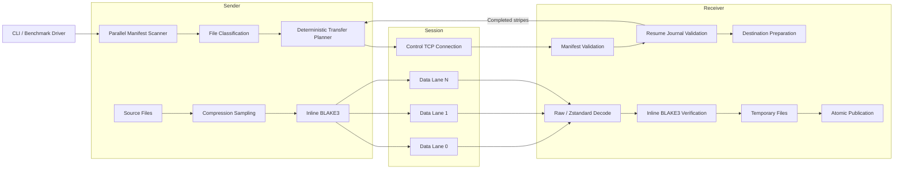
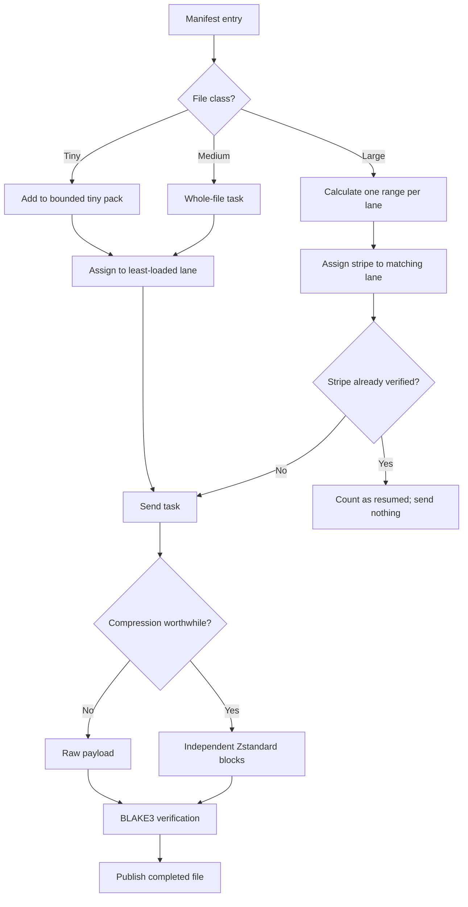
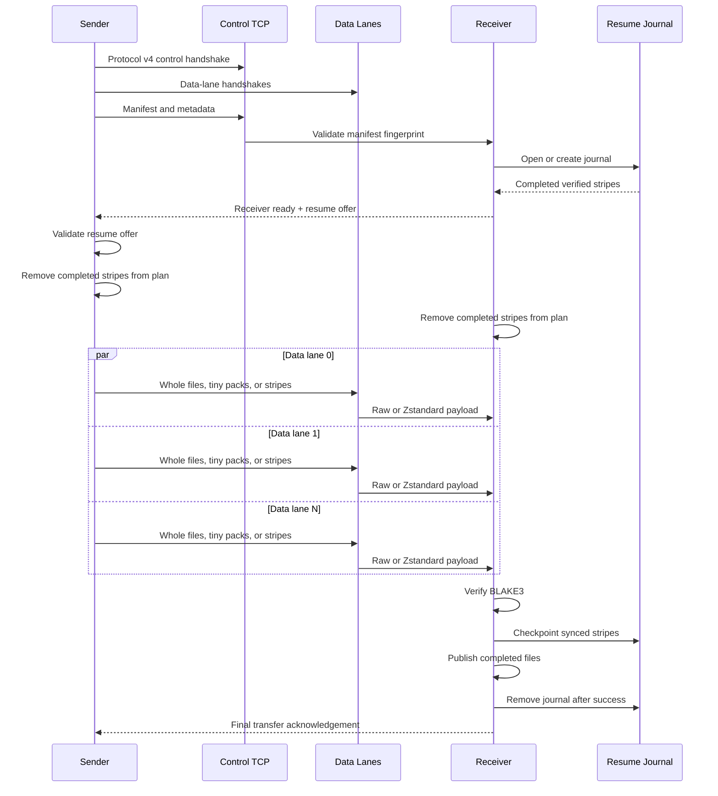

# NetworkCopy Speed Edition

> A Windows-only Rust experiment in moving absurd amounts of data without politely waiting for the operating system to finish thinking about it.

NetworkCopy Speed Edition is a performance-first file-transfer engine built in Rust for Windows.

The project starts with deliberately simple copy benchmarks, then progressively builds the machinery required for a serious high-speed transfer tool:

* native Windows overlapped file I/O;
* I/O completion ports;
* parallel directory scanning;
* exact UTF-16 path transport;
* multiple TCP data lanes;
* large-file striping;
* tiny-file packing;
* BLAKE3 integrity verification;
* adaptive Zstandard compression;
* bounded memory usage;
* durable large-stripe resume journals.

It is currently an **engineering prototype and benchmark laboratory**, not yet a polished replacement for Explorer, Robocopy, or a production transfer appliance.

> **The complete multistream sender and receiver currently run inside one process over TCP loopback.**
>
> The transfer engine itself is functional, including resume support, but separate two-machine `send` and `receive` commands are the next major milestone.

```text
Platform:          Windows
Language:          Rust 2024 edition
Package version:   0.1.0
Protocol version:  4
Status:            Experimental resumable loopback transfer engine
Next milestone:    Real transfers between two Windows machines
```

---

## Why?

Copying a file appears simple:

```text
read bytes
write bytes
repeat
```

Then the source contains 250,000 tiny files, one file is 80 GiB, the destination is across a fast network, Windows caching becomes involved, antivirus starts inspecting everything, and the simple loop develops opinions.

NetworkCopy Speed Edition investigates the components required for a genuinely fast transfer engine:

* fast recursive directory enumeration;
* bounded and reusable memory;
* exact Windows path handling;
* asynchronous native file I/O;
* multiple simultaneous TCP streams;
* load balancing across transfer lanes;
* tiny-file aggregation;
* large-file striping;
* inline hashing and compression;
* interruption-safe partial files;
* resumable transfers;
* measured network-path calibration.

The project follows one important rule:

> **Measure every architectural idea before assuming it is faster.**

Several theoretically faster approaches lose to a straightforward synchronous loop under warm-cache local benchmarks. They remain valuable because a real transfer engine must overlap storage, networking, hashing, compression, and remote processing—not merely win a synthetic local copy race.

---

# Current capabilities

## Copy engines

* Measured synchronous buffered copying
* Reusable bounded-buffer pipeline
* Native Windows overlapped reads and writes
* I/O completion port integration
* Multiple outstanding native I/O operations
* Explicit 64-bit file offsets
* Positional concurrent reads and writes
* Configurable chunk and operation counts
* Strict buffer-pool limits

## Manifest scanner

* Parallel recursive directory scanning
* Fixed-size worker pool
* Shared directory work queue
* Deterministic manifest ordering
* Exact Windows UTF-16 relative paths
* File size capture
* Last-write timestamp capture
* Windows file attribute capture
* Reparse-point detection and skipping
* Sparse and compressed file statistics
* Tiny, medium, and large file classification
* Configurable scanner worker count

## TCP control plane

* Versioned binary protocol
* Session identifiers
* Separate control and data connection roles
* Configurable data-stream count
* Exact UTF-16 path serialization
* File metadata and class serialization
* Deterministic manifest fingerprint
* Receiver-readiness acknowledgement
* Resume-stripe negotiation
* Final transfer acknowledgement
* Socket timeouts
* TCP_NODELAY configuration

## Transfer engine

* Multiple concurrent TCP data lanes
* Deterministic sender and receiver scheduling
* Greedy whole-file load balancing
* Large-file striping across all active lanes
* Positional concurrent writes into large files
* Tiny-file aggregation into bounded packs
* Temporary destination files
* Atomic publication by rename
* Per-lane application-wire byte accounting
* Sender and receiver report comparison
* Complete manifest byte-count validation

## Integrity

* Streaming BLAKE3 hashing
* Inline sender hashing
* Inline receiver hashing
* No second disk pass for normal payload verification
* Whole-file BLAKE3 verification
* Tiny-pack member verification
* Per-stripe BLAKE3 verification for large files
* Digest mismatch rejection before publication

BLAKE3 currently protects against accidental corruption, implementation bugs, and damaged payloads.

It does **not** authenticate peers or protect against an active attacker capable of modifying both the payload and its digest. Encryption and authenticated sessions are future work.

## Adaptive compression

* Zstandard compression through `zstd`
* Configurable standalone compression probe
* Start, middle, and end sampling for large ranges
* Raw fallback when estimated savings are below 10%
* Independent decisions for medium files and large stripes
* Reusable compressor and decompressor contexts per lane
* Independent 1 MiB compression blocks
* BLAKE3 calculated over uncompressed content
* Actual application-wire size reporting

Tiny-file packs currently remain uncompressed.

## Bounded memory

The integrated transfer engine accounts for its predictable payload buffers before starting work.

Current per-lane, per-peer allocation plan:

```text
1 MiB   TCP buffered reader or writer
8 MiB   transfer buffer
2 MiB   maximum compressed chunk buffer
------
11 MiB  per lane, per peer
```

A loopback benchmark contains both peers in one process, so two lanes plan approximately:

```text
11 MiB × 2 lanes × 2 peers = 44 MiB
```

The current hard application-buffer ceiling is **4 GiB**.

This accounting covers the large deterministic transfer buffers. It does not attempt to include thread stacks, manifest allocations, allocator bookkeeping, or Windows kernel socket buffers.

## Resume support

Verified large-file stripes can survive an interrupted transfer.

The receiver maintains:

```text
.networkcopy-resume.bin
```

Large destination files remain unpublished as:

```text
<filename>.ncs-part-<file-id>
```

The resume journal records:

* manifest fingerprint;
* data-stream count;
* completed large-file stripe identifiers;
* stripe offsets;
* stripe lengths.

A stripe is checkpointed only after:

1. its payload has been received;
2. its BLAKE3 digest has been verified;
3. its bytes have been written;
4. the partial file has been synchronized;
5. the updated journal has been atomically published.

When reopening an interrupted destination:

* the journal must exist;
* its manifest fingerprint must match;
* its stream count must match;
* every offered stripe must exist in the current deterministic transfer plan;
* large partial files must have the expected logical size;
* verified stripes are negotiated and omitted from both transfer plans;
* medium and tiny files are currently retransmitted from the beginning.

On successful completion:

* large temporary files are renamed to their final names;
* the resume journal is removed.

An existing destination without a valid matching journal is rejected.

---

# File classes

| Class  |                       Boundary | Current strategy                   |
| ------ | -----------------------------: | ---------------------------------- |
| Tiny   |                  Up to 256 KiB | Group into bounded tiny-file packs |
| Medium | Above 256 KiB and below 64 MiB | Transfer whole on one lane         |
| Large  |               64 MiB and above | Stripe across active data lanes    |

These boundaries are architectural defaults, not universal laws carved into an NVMe controller.

---

# Architecture



---

## Transfer planning



---

## Session protocol



---

# Building

## Requirements

* Windows 10 or Windows 11
* A recent stable Rust toolchain
* Cargo
* A filesystem supporting normal Windows file operations

The project uses:

* `windows-sys` for native Win32 APIs;
* `blake3` for integrity verification;
* `zstd` for adaptive compression.

Build an optimized binary:

```powershell
cargo build --release
```

The resulting executable is:

```text
target\release\networkcopy-speed.exe
```

## Quality gate

Run the complete gate before committing:

```powershell
cargo fmt
cargo fmt --check
cargo test
cargo clippy --all-targets --all-features -- -D warnings
cargo build --release
```

---

# Commands

The current CLI consists of engineering probes and loopback benchmarks.

Run:

```powershell
cargo run --release -- help
```

or execute the built binary directly:

```powershell
.\target\release\networkcopy-speed.exe help
```

---

## Synchronous copy benchmark

```powershell
cargo run --release -- bench-copy `
    <source-file> `
    <destination-file> `
    [buffer-mib]
```

Example:

```powershell
cargo run --release -- bench-copy `
    ".\TestData\incompressible-2GiB.bin" `
    ".\BenchmarkOutput\baseline.bin" `
    8
```

---

## BLAKE3 benchmark

```powershell
cargo run --release -- bench-hash `
    <source-file> `
    [buffer-mib]
```

Example:

```powershell
cargo run --release -- bench-hash `
    ".\TestData\mixed-4GiB.bin" `
    8
```

---

## Adaptive compression probe

```powershell
cargo run --release -- probe-compression `
    <source-file> `
    [zstd-level]
```

Example:

```powershell
cargo run --release -- probe-compression `
    ".\TestData\compressible-512MiB.bin" `
    1
```

The probe samples the file, estimates its compression ratio, and reports whether the integrated engine would send it raw or compressed.

---

## Reusable buffered pipeline

```powershell
cargo run --release -- bench-pipeline `
    <source-file> `
    <destination-file> `
    [chunk-mib] `
    [buffers]
```

Example:

```powershell
cargo run --release -- bench-pipeline `
    ".\TestData\mixed-4GiB.bin" `
    ".\BenchmarkOutput\pipeline.bin" `
    8 `
    8
```

---

## Native IOCP probe

```powershell
cargo run --release -- probe-iocp
```

This creates an I/O completion port, posts a controlled completion packet, retrieves it, and validates the returned completion key and payload.

---

## Native overlapped-read probe

```powershell
cargo run --release -- probe-overlapped-read `
    <source-file> `
    [read-mib]
```

Example:

```powershell
cargo run --release -- probe-overlapped-read `
    ".\TestData\incompressible-2GiB.bin" `
    8
```

---

## Native IOCP file-copy benchmark

```powershell
cargo run --release -- bench-iocp-copy `
    <source-file> `
    <destination-file> `
    [chunk-mib] `
    [operations]
```

Example:

```powershell
cargo run --release -- bench-iocp-copy `
    ".\TestData\mixed-4GiB.bin" `
    ".\BenchmarkOutput\iocp.bin" `
    8 `
    8
```

---

## Parallel manifest scanner

```powershell
cargo run --release -- bench-scan `
    <root-directory> `
    [workers]
```

Example:

```powershell
cargo run --release -- bench-scan `
    "$HOME\.cargo\registry" `
    16
```

---

## TCP control-plane probe

```powershell
cargo run --release -- probe-control `
    <root-directory> `
    [workers] `
    [data-streams]
```

This command:

1. scans the source tree;
2. opens a loopback multistream session;
3. serializes the manifest;
4. validates it on the receiver;
5. returns a manifest acknowledgement.

---

## Multistream folder-copy benchmark

```powershell
cargo run --release -- bench-multistream-copy `
    <source-root> `
    <destination-root> `
    [workers] `
    [data-streams]
```

Example:

```powershell
cargo run --release -- bench-multistream-copy `
    ".\TestData" `
    ".\BenchmarkOutput\TestData-copy" `
    4 `
    2
```

This is currently the most complete integrated transfer path.

It exercises:

* parallel scanning;
* manifest serialization;
* multiple TCP data lanes;
* deterministic scheduling;
* tiny-file packing;
* large-file striping;
* adaptive compression;
* BLAKE3 verification;
* application-wire accounting;
* bounded memory;
* resume negotiation;
* durable large-stripe checkpoints;
* atomic final publication.

For a fresh transfer, the destination must not already exist.

For a resumed transfer, the destination must contain a matching valid resume journal and the expected partial large files.

---

## Standalone striped-file benchmark

```powershell
cargo run --release -- bench-striped-file `
    <source-file> `
    <destination-file> `
    [data-streams]
```

Example:

```powershell
cargo run --release -- bench-striped-file `
    ".\TestData\mixed-4GiB.bin" `
    ".\BenchmarkOutput\striped.bin" `
    2
```

---

# Representative benchmark snapshot

All measurements below were produced on one Windows development machine using local files and TCP loopback.

They are architecture-development measurements, **not general network-performance claims**.

Results can change significantly due to:

* Windows page cache state;
* source and destination storage;
* antivirus activity;
* compression ratio;
* CPU frequency and temperature;
* background I/O;
* stream count;
* test ordering.

## Integrated adaptive folder transfer

Representative dataset:

```text
2 GiB   incompressible file
4 GiB   mixed-content file
512 MiB highly compressible file
```

Observed result with two TCP data lanes:

```text
Logical data:         6,979,321,856 bytes
Application wire:    6,442,481,502 bytes
Compressed records:  2
Wire reduction:       7.69%
Planned buffers:      46,137,344 bytes
Throughput:           roughly 1.5–1.7 GB/s
Integrity:            BLAKE3 verified
```

The wire count is measured at the application data lanes. It does not include TCP, IP, Ethernet, VPN, or Wi-Fi framing overhead.

## Standalone large-file striping

A previous 4 GiB mixed-content loopback test produced:

| TCP lanes | Approximate throughput |
| --------: | ---------------------: |
|         1 |             2,093 MB/s |
|         2 |         **2,389 MB/s** |
|         4 |             2,241 MB/s |
|         8 |             1,980 MB/s |

Two streams were the local-loopback sweet spot for that machine. More streams increased contention rather than throughput.

This is exactly why the future two-machine mode will calibrate stream counts instead of blindly assuming that more sockets are better.

---

# Roadmap

## Milestone 0 — Baselines

* [x] Synchronous buffered copy
* [x] Reproducible throughput measurement
* [x] Configurable copy buffers
* [x] External hash verification

## Milestone 1 — Reusable buffer pipeline

* [x] Bounded buffer pool
* [x] Reader and writer pipeline
* [x] Configurable chunk and buffer counts
* [x] Hard memory-pool validation

## Milestone 2 — Native Windows I/O

* [x] Native overlapped reads
* [x] Native overlapped writes
* [x] I/O completion port wrapper
* [x] Multiple outstanding operations
* [x] Explicit offset handling
* [x] Cancellation and completion draining

## Milestone 3 — Manifest scanner

* [x] Parallel recursive scanning
* [x] Worker queue
* [x] Exact UTF-16 relative paths
* [x] Reparse-point skipping
* [x] File classification
* [x] Deterministic ordering
* [x] Sparse and compressed-file statistics

## Milestone 4 — TCP session

* [x] Versioned protocol
* [x] Control connection
* [x] Multiple data lanes
* [x] Manifest transfer
* [x] Session and stream identifiers
* [x] Receiver and final acknowledgements

## Milestone 5 — Transfer scheduling

* [x] Whole-file lane balancing
* [x] Large-file striping
* [x] Concurrent positional destination writes
* [x] Tiny-file packs
* [x] Temporary files and atomic rename
* [x] Sender and receiver accounting

## Milestone 6 — Integrity, compression, and memory

* [x] Measured BLAKE3 engine
* [x] Inline BLAKE3 verification
* [x] Per-stripe integrity
* [x] Compression sampling
* [x] Adaptive Zstandard
* [x] Raw fallback
* [x] Actual application-wire accounting
* [x] Hard 4 GiB transfer-buffer ceiling

## Milestone 7 — Resume and filesystem behavior

* [x] Durable resume journal
* [x] Atomic journal replacement
* [x] Verified stripe checkpoints
* [x] Resume identity validation
* [x] Resume-stripe control negotiation
* [x] Transfer-plan filtering
* [x] Reopen interrupted destinations
* [ ] Automated process-interruption test
* [ ] Metadata restoration
* [ ] Sparse-file range preservation
* [ ] Medium-file chunk resume
* [ ] Tiny-pack resume
* [ ] Source snapshot consistency checks
* [ ] Delta transfer

## Milestone 8 — Real two-machine mode

Next major milestone.

Planned command shape:

```text
Receiver:
networkcopy-speed receive <bind-address> <destination> [data-streams]

Sender:
networkcopy-speed send <receiver-address> <source> [workers] [data-streams]
```

Planned work:

* [ ] Separate sender and receiver CLI commands
* [ ] Bind the receiver to a configurable interface and port
* [ ] Connect sender data lanes to a remote machine
* [ ] Preserve the current protocol and transfer planner
* [ ] Real-network raw TCP calibration
* [ ] Test 1, 2, 4, and 8 streams
* [ ] Tune socket buffers and in-flight data
* [ ] Compare engine throughput against measured TCP ceiling
* [ ] Target at least 85–90% of the measured path capacity
* [ ] Firewall guidance
* [ ] Standalone release binaries
* [ ] End-to-end two-machine acceptance test

## Milestone 9 — Direct Link Mode

Planned after the first real-network release:

* [ ] Detect physical Ethernet interfaces
* [ ] Reject Wi-Fi, VPN, Hyper-V, and WSL routes
* [ ] Prefer IPv6 link-local addressing
* [ ] Handle IPv6 scope identifiers correctly
* [ ] Fall back to direct-link IPv4
* [ ] Bind every control and data socket to the selected interface
* [ ] Validate the chosen path
* [ ] Calibrate the direct cable
* [ ] Recover cleanly if the link disappears

The intended use case is a direct copper cable between two Windows computers, with no router or switch required.

---

# Known limitations

* Windows only
* Current complete sender and receiver run in one process over loopback
* No authenticated peer identity
* No encryption
* No protection against an active man-in-the-middle
* No polished production CLI yet
* No service or background-agent mode
* No GUI
* No automatic firewall configuration
* No metadata restoration yet
* Sparse files are detected but not preserved sparsely yet
* Medium and tiny files restart from the beginning after interruption
* Large-file resume depends on the journal and partial file remaining intact
* Source files changing during transfer are not fully snapshot-isolated
* Compression decisions are sample-based
* Compression is chosen per record, not independently for every block
* Benchmark results are heavily machine-dependent

---

# Source layout

```text
src/
├── adaptive_compression.rs   Raw/Zstandard payload codec
├── compression_probe.rs      Sampling and compression decisions
├── content_hash.rs           BLAKE3 hashing
├── control_plane.rs          Protocol, handshakes, and manifests
├── copy_bench.rs             Synchronous copy baseline
├── iocp_copy.rs              Native overlapped IOCP copy engine
├── iocp_file_probe.rs        Overlapped file-read probe
├── iocp_probe.rs             IO completion port wrapper and probe
├── main.rs                   CLI and benchmark driver
├── manifest_scan.rs          Parallel deterministic scanner
├── multistream_copy.rs       Integrated folder-transfer engine
├── pipeline_bench.rs         Reusable buffered pipeline
├── resume_state.rs           Durable resume journal
├── striped_file.rs           Positional striped-file transfer
└── transfer_memory.rs        Transfer memory planning and limits
```

---

# Development philosophy

This repository intentionally keeps several generations of the transfer engine.

The older benchmark paths are not dead weight. They provide measured baselines and isolate individual mechanisms:

* synchronous file copying;
* reusable buffer pipelines;
* native IOCP;
* manifest scanning;
* control-plane serialization;
* striped file transfer;
* integrated folder transfer.

That makes regressions easier to diagnose and prevents architectural enthusiasm from replacing evidence.

The project is not trying to produce the most abstract file-copy framework possible.

It is trying to answer a much more useful question:

> How close can a carefully measured Windows transfer engine get to the real storage and network limits of the machines running it?

---

# Safety and data-loss warning

This project is experimental.

Do not use it as the sole copy of important data.

Before trusting a transfer:

1. keep the source intact;
2. verify the destination independently;
3. test interruption and resume behavior on disposable data;
4. avoid untrusted networks;
5. do not assume metadata, permissions, sparse allocation, or alternate data streams are preserved.

The current engine validates file payloads with BLAKE3, but payload integrity is only one part of a production-grade file-transfer system.
