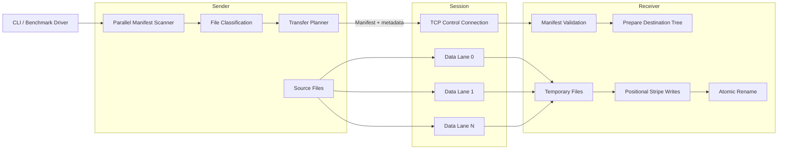
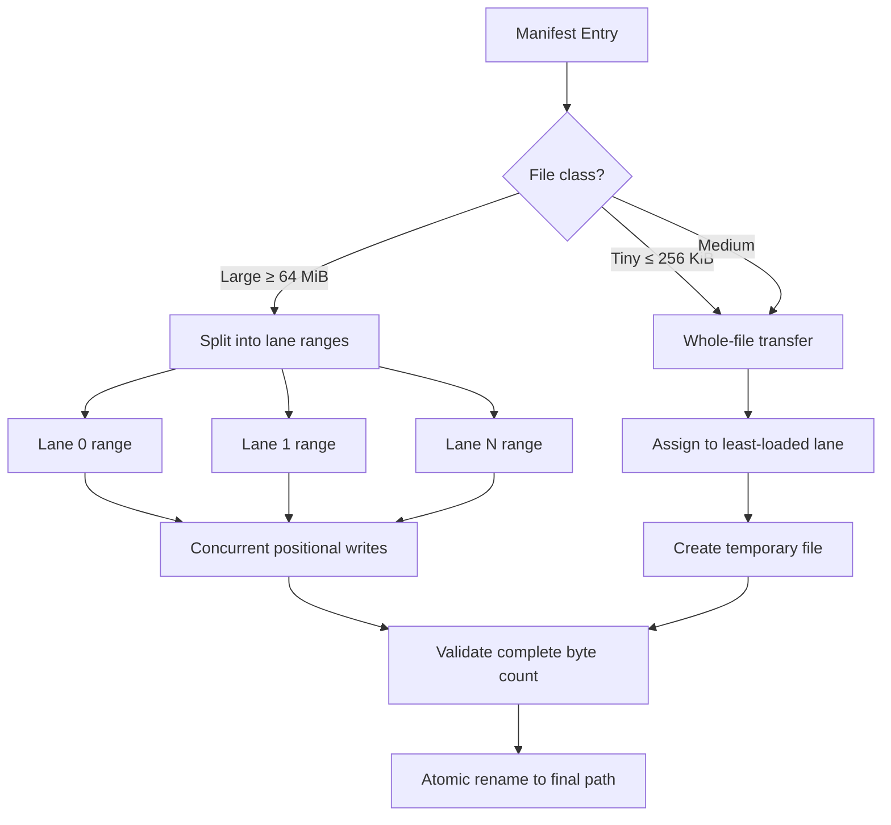
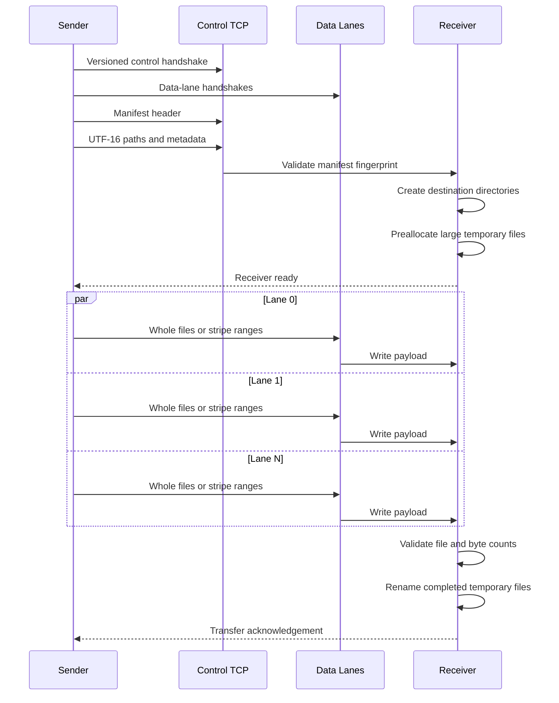

# NetworkCopy Speed Edition

> A Windows-only Rust experiment in moving absurd amounts of data without politely waiting for the operating system to finish thinking about it.

NetworkCopy Speed Edition is a performance-focused file-transfer engine built from first principles in Rust.

The project explores the full path from a simple synchronous copy loop to native Windows overlapped I/O, IO completion ports, parallel manifest scanning, versioned binary protocols, multiple TCP data lanes, and striped large-file transfers.

It is currently an engineering prototype and benchmark laboratory—not yet a friendly end-user replacement for Explorer, Robocopy, or your favorite enterprise transfer appliance.

> **The current sender and receiver run inside one process over TCP loopback.**
>
> The project does not yet provide separate commands that can be launched on two different computers. That becomes the explicit v1.0 deliverable in Milestone 8.

```text
Platform:       Windows
Language:       Rust
Native API:     Win32 through windows-sys
Current tests:  22
Current commit: 9569197
Status:         M5 large-file striping integrated
Release status: Experimental loopback prototype
v1.0 target:    Real transfers between two Windows machines
```

---

## Why?

Copying a file sounds simple:

```text
read bytes
write bytes
repeat
```

Then the directory contains 250,000 files, one file is 80 GiB, the destination is across a fast network, Windows caching gets involved, and suddenly the simple loop has opinions.

This project investigates the pieces required for a genuinely fast transfer engine:

* Fast directory enumeration
* Low-allocation manifest construction
* Exact Windows path handling
* Multiple independent TCP streams
* Native overlapped file I/O
* Large-file striping
* Tiny-file aggregation
* Resume and sparse-range support
* Adaptive hashing and compression
* Separate sender and receiver applications
* Real transfers between two Windows machines
* Standalone v1.0 release binaries

The important rule is simple:

> Measure every architectural idea before assuming it is faster.

Several “faster” designs in this repository are slower than the synchronous baseline under warm-cache conditions. They remain valuable because they enable overlap between storage, networking, hashing, compression, and remote hosts.

---

# Current capabilities

## Copy engines

* Measured synchronous buffered copying
* Reusable bounded buffer pipeline
* Native Windows overlapped reads and writes
* IO completion port integration
* Multiple outstanding native I/O operations
* Explicit 64-bit file offsets
* Positional concurrent reads and writes

## Manifest scanner

* Parallel recursive scanning
* Fixed-size worker pool
* Shared directory work queue
* Exact Windows UTF-16 relative paths
* File size and last-write timestamp capture
* Windows file attribute capture
* Reparse-point detection and skipping
* Sparse and compressed file statistics
* Tiny, medium, and large file classification

## TCP control plane

* Versioned binary protocol
* Session IDs
* Control and data connection roles
* Configurable data-stream count
* Manifest integrity fingerprint
* Receiver readiness acknowledgement
* Final transfer acknowledgement
* Exact UTF-16 path serialization
* Metadata and file-class serialization

## Transfer engine

* Multiple concurrent TCP data lanes
* Greedy whole-file load balancing
* Temporary destination files
* Atomic rename after completion
* Whole-file medium and tiny transfers
* Large-file striping across all active lanes
* Concurrent positional writes into striped files
* Sender and receiver byte-count validation
* End-to-end SHA-256 verification during development

---

# Architecture



---

## Transfer decision flow



Tiny files currently use the whole-file path. Aggregated tiny-file packs are the remaining part of Milestone 5.

---

## Session protocol



---

# File classes

| Class  |  Current boundary | Transfer strategy              |
| ------ | ----------------: | ------------------------------ |
| Tiny   |     Up to 256 KiB | Whole-file transfer            |
| Medium | 256 KiB to 64 MiB | Whole-file transfer            |
| Large  |  64 MiB and above | Striped across every data lane |

These boundaries are architectural starting points, not sacred laws carved into an NVMe controller.

---

# Building

The project requires Windows and a recent stable Rust toolchain.

```powershell
cargo build --release
```

Run the complete quality gate:

```powershell
cargo fmt
cargo fmt --check
cargo test
cargo clippy --all-targets --all-features -- -D warnings
cargo build --release
```

Current expected result:

```text
22 tests passed
strict Clippy clean
release build successful
```

---

# Commands

## Synchronous control benchmark

```powershell
cargo run --release -- bench-copy `
    <source-file> `
    <destination-file> `
    [buffer-mib]
```

Example:

```powershell
cargo run --release -- bench-copy `
    ".\TestData\incompressible-2GiB.bin" `
    ".\BenchmarkOutput\baseline.bin" `
    8
```

---

## Reusable buffered pipeline

```powershell
cargo run --release -- bench-pipeline `
    <source-file> `
    <destination-file> `
    [chunk-mib] `
    [buffers]
```

---

## Native IOCP probe

```powershell
cargo run --release -- probe-iocp
```

This creates an IO completion port, posts a controlled completion packet, retrieves it, and validates the completion key and payload.

---

## Native overlapped-read probe

```powershell
cargo run --release -- probe-overlapped-read `
    <source-file> `
    [read-mib]
```

---

## Native IOCP file copy

```powershell
cargo run --release -- bench-iocp-copy `
    <source-file> `
    <destination-file> `
    [chunk-mib] `
    [operations]
```

---

## Parallel manifest scanner

```powershell
cargo run --release -- bench-scan `
    <root-directory> `
    [workers]
```

Example:

```powershell
cargo run --release -- bench-scan `
    "$HOME\.cargo\registry" `
    16
```

---

## TCP control-plane probe

```powershell
cargo run --release -- probe-control `
    <root-directory> `
    [workers] `
    [data-streams]
```

This scans the tree, opens a complete multistream TCP session, serializes the manifest over the control connection, validates it on the receiver, and returns an acknowledgement.

---

## Multistream folder copy

```powershell
cargo run --release -- bench-multistream-copy `
    <source-root> `
    <destination-root> `
    [workers] `
    [data-streams]
```

The destination must not already exist.

Example:

```powershell
cargo run --release -- bench-multistream-copy `
    ".\TestData" `
    ".\BenchmarkOutput\TestData-copy" `
    4 `
    2
```

Large files are striped across the configured lanes. Medium and tiny files are assigned whole to the least-loaded lane.

---

## Standalone striped file copy

```powershell
cargo run --release -- bench-striped-file `
    <source-file> `
    <destination-file> `
    [data-streams]
```

Example:

```powershell
cargo run --release -- bench-striped-file `
    ".\TestData\mixed-4GiB.bin" `
    ".\BenchmarkOutput\striped.bin" `
    2
```

---

# Benchmark snapshot

All results below were measured on one Windows machine using local files and TCP loopback.

These are architecture-development measurements, not claims about general network performance. Windows page cache, source freshness, destination state, antivirus activity, storage hardware, and thermal conditions can materially change the results.

## Local copy engines

| Engine            | Configuration         | Approximate throughput |
| ----------------- | --------------------- | ---------------------: |
| Synchronous copy  | 8 MiB buffer          |             3,143 MB/s |
| Buffered pipeline | 8 MiB × 8 buffers     |             2,279 MB/s |
| Native IOCP       | 8 MiB × 8 operations  |             2,100 MB/s |
| Native IOCP       | 2 MiB × 16 operations |             2,080 MB/s |

The synchronous loop wins this warm-cache workload. IOCP remains important because it allows file I/O to overlap with networking and other processing.

## Manifest control plane

| Tree                 | Entries | Wire size | Manifest throughput | Entry rate |
| -------------------- | ------: | --------: | ------------------: | ---------: |
| Development projects |  30,958 |   6.53 MB |         169.80 MB/s |  805,577/s |
| Cargo registry       | 257,361 |  47.70 MB |         181.21 MB/s |  977,697/s |

## Large-file striping

4 GiB mixed-content file:

| TCP lanes |        Throughput |
| --------: | ----------------: |
|         1 |     2,092.81 MB/s |
|         2 | **2,388.96 MB/s** |
|         4 |     2,241.22 MB/s |
|         8 |     1,979.58 MB/s |

Two streams were the local-loopback sweet spot. More streams increased contention.

## Integrated folder transfer

| Dataset  | Files |    Data | Streams |    Throughput |
| -------- | ----: | ------: | ------: | ------------: |
| TestData |     2 | 6.44 GB |       2 | 1,659.60 MB/s |

Both integrated destination files matched their source SHA-256 hashes.

---

# Integrity model

The current prototype performs several structural integrity checks:

* Manifest fingerprint validation
* Sender and receiver entry-count comparison
* Sender and receiver byte-count comparison
* File ID validation
* Stripe offset and length validation
* Source-size revalidation before transfer
* Duplicate stream detection
* Session ID verification
* Stream count verification
* Temporary-file staging
* Atomic final rename
* Rejection of unsafe relative path components
* Reparse-point skipping during scanning

Cryptographic per-file hashing is not yet part of the production protocol. SHA-256 has been used externally during development to validate transferred outputs.

---

# Repository layout

```text
src/
├── main.rs                CLI and benchmark commands
├── copy_bench.rs          Synchronous copy baseline
├── pipeline_bench.rs      Reusable buffered pipeline
├── iocp_probe.rs          Native IOCP wrapper and probe
├── iocp_file_probe.rs     First real overlapped file read
├── iocp_copy.rs           Native overlapped IOCP copy engine
├── manifest_scan.rs       Parallel manifest scanner
├── control_plane.rs       Versioned TCP control protocol
├── multistream_copy.rs    Multistream folder transfer
└── striped_file.rs        Standalone large-file striping
```

---

# Milestone status

| Milestone | Description                                        | Status      |
| --------- | -------------------------------------------------- | ----------- |
| M0        | Measured synchronous local-copy baseline           | Complete    |
| M1        | Reusable buffers and parallel pipeline             | Complete    |
| M2        | Native Windows overlapped I/O and IOCP             | Complete    |
| M3        | Fast manifest scanner and classification           | Complete    |
| M4        | TCP control channel and multiple data streams      | Complete    |
| M5        | Tiny-file packing and large-file striping          | In progress |
| M6        | Adaptive compression, hashing, and memory budget   | Planned     |
| M7        | Chunk resume, sparse ranges, and delta copying     | Planned     |
| M8        | Two-machine operation, packaging, and v1.0 release | Planned     |

Completed M5 components:

* Standalone striped file transfer
* Integrated large-file striping
* Concurrent positional destination writes

Remaining M5 component:

* Tiny-file aggregation and packed transfer

Release goal:

* M5–M7 complete the transfer engine.
* M8 turns that engine into an installable two-machine product.
* The first public stable release will be tagged `v1.0.0` only after a real cross-machine acceptance test passes.

---

# Roadmap

## M5 — Finish tiny-file packing

Thousands of tiny files should not each pay for:

* A separate protocol frame
* A separate send cycle
* A separate receive cycle
* Repeated buffer transitions

The planned pack format will group many tiny files into larger transfer records while preserving individual file IDs and boundaries.

## M6 — Adaptive processing

Planned work:

* Fast content hashing
* Per-file or per-chunk verification
* Compression sampling
* Skip compression for incompressible data
* Bounded shared memory budget
* Concurrent read, hash, compression, network, and write stages

## M7 — Resumable transfer

Planned work:

* Persistent chunk maps
* Resume interrupted sessions
* Sparse-file range discovery
* Skip already-matching ranges
* Delta transfer for changed files
* Crash-safe temporary state
* Final verification before promotion

## M8 — Two-machine operation and v1.0

Milestone 8 turns the benchmark architecture into software that can actually be installed on two Windows computers and used to copy files between them.

### Separate process roles

The single-process loopback harness will be split into explicit receiver and sender modes.

Planned command shape:

```powershell
networkcopy-speed receive `
    --listen 0.0.0.0:47321 `
    --destination "D:\Incoming"
````

On the sending computer:

```powershell
networkcopy-speed send `
    --to 192.168.1.50:47321 `
    --source "C:\Data"
```

The exact interface may change before release, but v1.0 must support launching the receiver on one Windows machine and the sender on another without modifying the source code.

### Network operation

The v1.0 network layer must provide:

* Configurable listen address and TCP port
* Connection to remote IPv4 and IPv6 addresses
* Remote hostname support
* Protocol-version negotiation
* Feature negotiation between different builds
* Clear connection and timeout errors
* Graceful handling of disconnected data lanes
* Validation that every connection belongs to the correct session
* Configurable number of TCP data streams
* Sensible defaults for normal LAN use

### Receiver safety

The receiving computer must control where files can be written.

Required safeguards:

* Explicit destination root selected by the receiver
* No sender-controlled absolute destination paths
* Rejection of `..`, drive prefixes, UNC roots, and unsafe path components
* Temporary-file staging
* Atomic publication of completed files
* Cleanup or preservation of interrupted temporary files
* Configurable behavior when destination files already exist
* Free-space checks before transfer begins
* Confirmation before destructive overwrite behavior

### User-facing transfer workflow

v1.0 must provide:

* Recursive folder transfer
* Single-file transfer
* Human-readable progress
* Current file and overall byte progress
* Transfer speed
* Elapsed time and estimated remaining time
* File counts
* Cancellation with clean shutdown
* Final success or failure summary
* Useful error messages containing the affected file or connection

A non-interactive output mode should also be available for scripts and automation.

### Integrity and recovery

Before v1.0, remote transfers must no longer rely only on aggregate byte counts.

Required integrity features:

* Per-file or per-chunk cryptographic hashes
* Receiver verification before final rename
* Detection of source files changing during transfer
* Explicit reporting of failed files
* Safe retry behavior
* Resume support for interrupted large files
* Session state that cannot silently combine data from different transfers

### Packaging

v1.0 should be usable without installing Rust.

Release deliverables:

* Standalone optimized Windows executable
* Version information embedded in the binary
* GitHub or Gitea release archive
* SHA-256 checksum for the release artifact
* Example sender and receiver commands
* Windows Defender and firewall notes
* Upgrade and compatibility notes
* License file
* Complete README usage guide

A service installer, graphical interface, and automatic discovery are optional post-v1.0 features. The first release only needs a dependable command-line workflow.

### Required v1.0 acceptance test

The release is not v1.0 until this succeeds:

1. Copy the release executable to two separate Windows computers.
2. Start receiver mode on computer B.
3. Start sender mode on computer A.
4. Transfer a mixed directory tree containing:

   * Empty files
   * Thousands of tiny files
   * Unicode paths
   * Medium files
   * Multiple large files
   * At least one file larger than 4 GiB
5. Interrupt one transfer and resume it.
6. Verify every received file cryptographically.
7. Confirm that no partial file is exposed under its final name.
8. Repeat over both a normal LAN and a direct Ethernet connection.

Only after that test passes should the project be tagged:

```text
v1.0.0
```

---

# Known limitations

* Sender and receiver currently run inside the same process over TCP loopback; the program cannot yet copy between two computers.
* Networking currently binds to loopback rather than exposing a configurable remote receiver.
* Destination directories must not already exist.
* File timestamps and attributes are serialized but not yet fully restored.
* Reparse points are skipped rather than recreated.
* Empty directories are not represented independently in the manifest.
* Tiny files are not packed yet.
* No production authentication or encryption layer exists.
* No cryptographic hash is carried in the transfer protocol yet.
* No resume support exists.
* Error recovery currently favors correctness and explicit failure over continuation.
* Benchmarks are strongly affected by Windows caching.

---

# Design principles

1. **Correctness before cleverness.**
2. **Measure before optimizing.**
3. **Keep memory bounded.**
4. **Use explicit offsets for concurrent I/O.**
5. **Never trust network-provided paths.**
6. **Do not publish partial destination files as complete.**
7. **Preserve simple baselines as controls.**
8. **Treat “more threads” as a hypothesis, not a personality trait.**

---

# Project status

NetworkCopy Speed Edition is currently a learning and experimentation project.

It already contains a working end-to-end architecture:

```text
scan
→ classify
→ serialize manifest
→ negotiate session
→ schedule files
→ stripe large files
→ transfer over multiple TCP lanes
→ write temporary destinations
→ validate counts
→ atomically publish completed files
```

The immediate target is tiny-file packing, after which the project will have specialized transfer strategies for all three file classes.

The longer path to v1.0 is equally important: split the loopback harness into real sender and receiver processes, add remote connection handling, integrity verification, resume support, user-facing progress, safe destination policies, and standalone Windows release binaries.

---

Built with Rust, Win32, unreasonable curiosity, and repeated proof that adding more threads does not automatically make the number go up.
