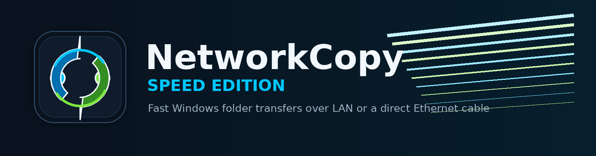
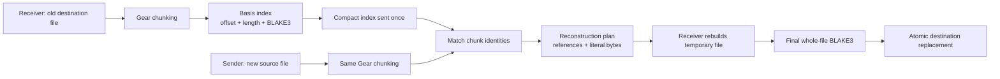
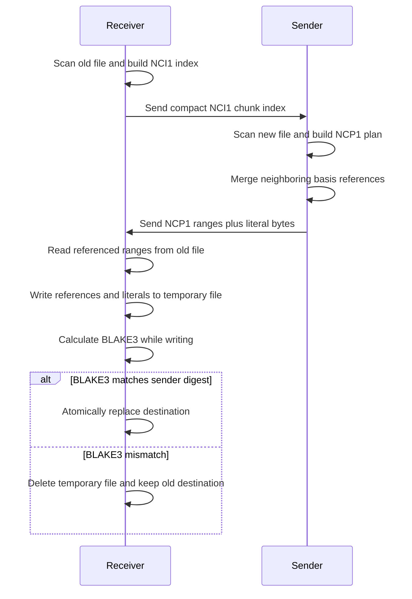
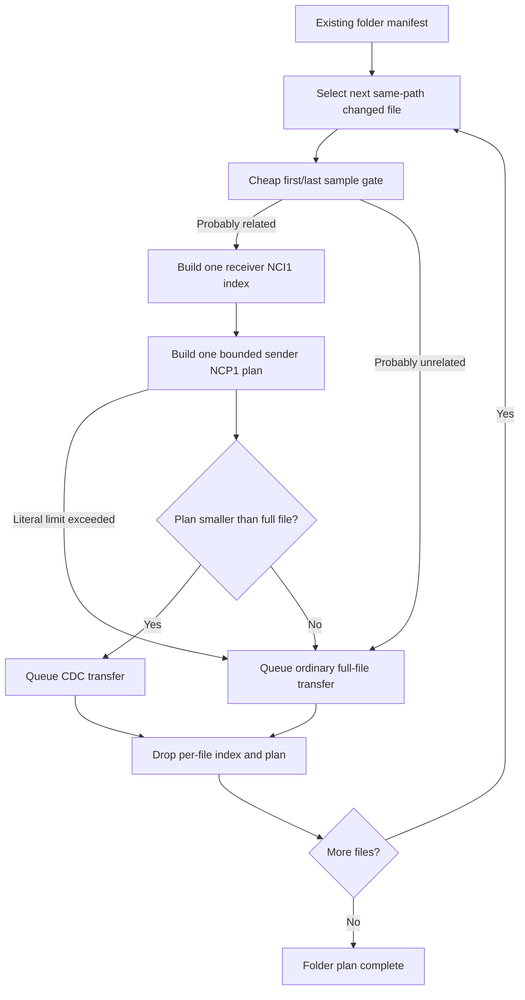
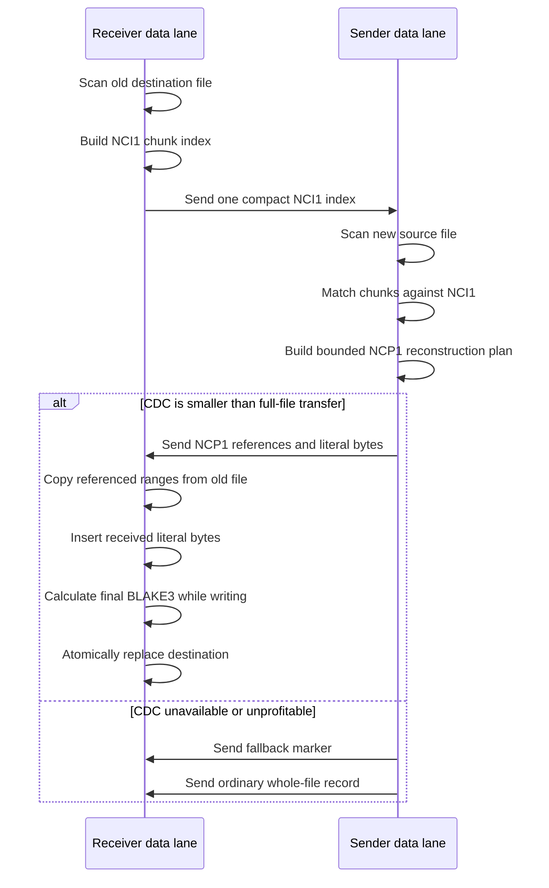
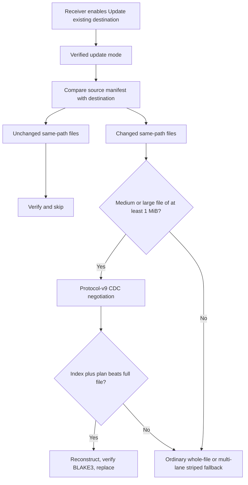
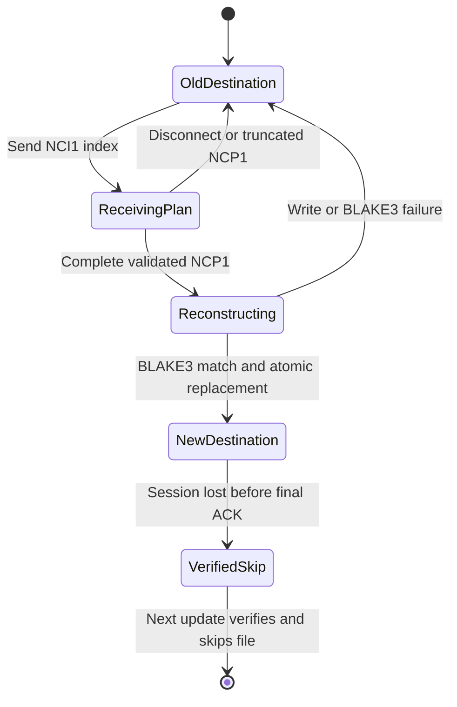
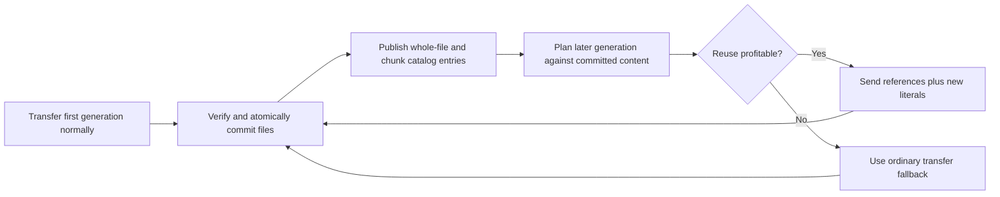

<p align="center">
  
</p>

# NetworkCopy Speed Edition

A high-performance Windows folder-transfer tool written in Rust.

NetworkCopy can transfer folders across a normal local network or directly
between two computers connected by an Ethernet cable. Direct Link Mode does
not require a router, switch, DHCP server, or manually assigned IP addresses.

The repository contains:

- high-performance command-line and desktop transfer front ends;
- automatic LAN, Direct Link, and manual IP transfer modes;
- a dedicated self-elevating endpoint agent;
- a WGPU management application for remote browsing and orchestration;
- one shared networking and transfer engine used by every front end.

## Current status

Current stable release:

```text
2.3.0
```

Current development version:

```text
2.4.0-dev
```

v2.3 adds persistent queued orchestration, restart-safe queue recovery,
Automatic LAN, managed Direct Link and Explicit IP routing, Windows transfer
notifications, an endpoint-agent tray control, and a GitHub Releases update
checker.

Select several independent source and destination pairs, start the queue, and
leave the machines to complete the work sequentially. Failed or blocked work
remains visible and requires an explicit retry, skip, or continuation.

v2 supports verified content reuse during both updates
and fresh folder transfers. Update mode reuses content from older receiver-side
medium and large files. Fresh transfers use deterministic bounded catalog
generations, explicit receiver commit acknowledgements, exact-file reuse, and
session-scoped cross-file CDC using files committed by earlier generations.

The v2 transfer engine has passed physical two-machine acceptance over a normal
LAN. The acceptance run achieved 98.48 MB/s, reconstructed a 60 MiB related
file using 59.88 MiB of receiver-side data, transmitted no CDC basis index,
reported 99.80% CDC savings, and passed independent SHA-256 verification for
every transferred file.

The GUI includes:

- Hungarian default language;
- English built into the same executable;
- runtime language switching;
- Direct Link and manual IP-address modes;
- Send and Receive operation selection;
- native Windows folder pickers;
- live phase, byte, percentage, and throughput progress;
- immediate cooperative cancellation;
- persistent interrupted-transfer records;
- one-click transfer restart and stripe resume;
- automatic administrator elevation when Receive requires firewall setup;

## v2.1 roadmap

- [x] persist committed fresh-transfer file IDs in the resume journal;
- [x] preserve and verify committed files during fresh-session restart;
- [x] rebuild deterministic catalog state from a committed generation prefix;
- [x] retain cross-file CDC reuse after interruption and restart;
- [x] extend exact reuse to tiny-file packs;
- [x] extend exact reuse to striped large files;
- [x] add repeated crash, corruption, and restart acceptance tests;
- [x] complete two-Windows-instance direct-link interruption acceptance.

### v2.1 interruption acceptance

The release candidate was tested between two independent Windows virtual
machines using automatic Direct Link discovery over IPv6 link-local addresses.

The receiver was forcibly terminated after the first 480 MiB generation had
been committed and atomically journaled. After restart, NetworkCopy verified and
skipped all eight committed files, then reconstructed eight related files using
the preserved receiver-side catalog.

The resumed session reported:

- 8 skipped committed files / 503,316,480 bytes;
- 8 completed CDC files and 0 fallbacks;
- 501,686,315 reused bytes;
- 1,630,165 literal bytes;
- 0 CDC index wire bytes;
- 99.84% total wire savings;
- matching independent SHA-256 manifests;
- successful resume-journal removal after completion.

Physical network throughput and Direct Link discovery had already passed the
v2.0 two-machine acceptance. The v2.1 run specifically validates the new
interruption, verification, catalog reconstruction, and restart behavior.

### Automated v2.1 recovery torture

The long-running recovery matrices are ignored during ordinary `cargo test`
runs. They repeatedly exercise fresh-generation crashes, multiple restarts,
cross-file CDC catalog recovery, same-size corruption rejection, and large-file
stripe checkpoint recovery.

Run ten rounds of every matrix in release mode:

```powershell
.\scripts\run-v21-torture.ps1 -Rounds 10
```

Use a smaller round count for a quick local smoke run:

```powershell
.\scripts\run-v21-torture.ps1 -Rounds 2
```

### Automated v2.1 release-candidate gate

The release builder can run the complete local gate, execute the ignored
recovery matrices, build the CLI and both GUI language variants, smoke-test the
CLI version output, and generate SHA-256 checksums.

While the package version remains `2.1.0-dev`, create a local release candidate
with two torture rounds per matrix:

```powershell
.\scripts\Build-Release.ps1 `
    -AllowDevelopmentVersion `
    -TortureRounds 2
```

For the final pre-release local gate, use ten rounds:

```powershell
.\scripts\Build-Release.ps1 `
    -AllowDevelopmentVersion `
    -TortureRounds 10
```

The `-AllowDevelopmentVersion` switch must be removed after `Cargo.toml` is
changed to the stable `2.1.0` version.

## v2.2 release — LAN management

v2.2 ships a separate management interface that discovers NetworkCopy sender
and receiver agents on the local network and remotely orchestrates transfers
between them.

The management computer carries only commands, status, and progress data.
File payloads travel directly from the selected sender to the selected receiver.

Released v2.2 scope and follow-ups:

- [x] add a persistent LAN-visible agent process;
- [x] connect the agent to sender and receiver job control;
- [x] automatically cancel a still-active endpoint when its paired job fails or is cancelled;
- [x] advertise and discover available agents on the LAN;
- [x] report machine name, reachable management address, capabilities, and current state;
- [x] remotely enumerate Windows drive roots on each endpoint;
- [x] remotely enumerate folders and files on each endpoint;
- [x] select the source machine and source folder;
- [x] select the receiver machine and destination folder;
- [ ] support Direct Link and explicit IP transfer modes;
- [x] start sender and receiver transfer jobs remotely;
- [x] expose live managed-job progress for GUI polling;
- [x] retain the most recent completed, cancelled, or failed job result;
- [x] resume interrupted transfer jobs remotely from retained manager history;
- [x] keep active transfers running if the management UI disconnects;
- [x] reconnect the manager to a paired transfer already running on the endpoints;
- [x] add an initial separate WGPU management application;
- [x] add remote dual-pane folder browsing to the management application;
- [x] add paired session history and richer diagnostics to the management application;
- [x] persist management configuration and transfer history across manager restarts;
- [x] polish the management workflow with compact status, collapsible setup, and collapsible history;
- [x] provide a double-clickable, self-elevating endpoint agent executable;
- [ ] test three-machine orchestration on a physical LAN.

The first v2.2 management release will intentionally use a trusted-LAN model
without authentication or encryption. It must only be used on a known,
controlled network. Pairing, authenticated commands, encrypted management
traffic, allowed-root policies, and stronger remote-filesystem protections are
planned after the working management workflow has been field-tested.

### v2.2 release highlights

- dedicated double-clickable endpoint agent with automatic UAC elevation;
- safe idle-agent restart without interrupting active transfers;
- LAN discovery with manual management-address fallback;
- remote Windows drive and directory browsing;
- independent sender and receiver selection;
- direct sender-to-receiver payload transfer;
- remote start, status polling, cancellation, and paired failure cleanup;
- manager disconnect and active-transfer reconnection;
- persistent transfer configuration and result history;
- journal-backed retry of cancelled and failed transfers;
- polished collapsible WGPU management interface;
- packaged manager, agent, CLI, and Hungarian/English GUI executables.

The v2.2 manager schedules one paired transfer at a time. Persistent queued
orchestration is planned for v2.3.

Management traffic remains unauthenticated and unencrypted in v2.2. Use the
management agent only on a known and controlled local network.

## v2.3 release — effortless queued transfers

v2.3 introduces a persistent manager-side transfer queue. Endpoint agents remain
simple one-job-at-a-time executors, while the manager owns ordering, persistence,
conflict detection, failure handling, resume, and automatic start-next behavior.

The primary workflow is:

1. select the sender and receiver;
2. add several source and destination pairs;
3. start the queue;
4. leave the machines alone while the transfers run in sequence.

### v2.3 release highlights

- persistent sequential transfer queue with stable request IDs;
- queue order, state, pause preference, route intent, and recovery persistence;
- automatic start-next behavior with safe unavailable and busy endpoint checks;
- explicit retry, run-again, skip, cancellation, and pause-after-current controls;
- journal-backed queued resume with the original stream count;
- safe Manager restart reattachment without silently duplicating active work;
- Automatic LAN, Direct Link, and Explicit IP management routes;
- dual-stack IPv4 and IPv6 management control;
- strict gateway-free physical-Ethernet Direct Link discovery;
- scoped IPv6 link-local preference with IPv4 APIPA fallback;
- completion, failure, pause, and action-required Windows notifications;
- endpoint-agent notification-area control with idle/busy status and safe exit;
- background GitHub Releases update checks with an explicit browser-opening flow;
- packaged Manager, Agent, CLI, and Hungarian/English GUI executables.

Management traffic remains unauthenticated and unencrypted. Use management mode
only on a known and controlled network.

### Released v2.3 scope and pending field acceptance

- [x] add stable-ID queued transfer requests;
- [x] persist queue order and state across manager restarts;
- [x] add, reorder, remove, and clear queue entries;
- [x] show the current, next, and remaining transfers;
- [x] start the next eligible transfer automatically;
- [x] detect unavailable, busy, and conflicting endpoints;
- [x] support pausing after the current transfer;
- [x] retain failed work and require an explicit retry, skip, or continuation;
- [x] queue journal-backed resume operations with their original stream count;
- [x] reconnect a restarted manager to the correct active queue item;
- [x] expose Automatic LAN, Direct Link, and Explicit IP manager route modes;
- [x] add useful Windows completion, failure, pause, and action-required notifications;
- [x] add a small endpoint-agent tray control surface;
- [x] check GitHub Releases for newer stable versions and open the download flow;
- [ ] complete physical three-machine and queued-transfer acceptance testing.

### Managed Direct Link progress

- [x] persist route intent in Manager configuration and queued requests;
- [x] support functional Explicit IP management endpoints;
- [x] add the Automatic LAN, Direct Link, and Explicit IP route selector;
- [x] preserve route intent during queue execution and Manager restart recovery;
- [x] add dual-stack IPv4 and IPv6 management-control listeners;
- [x] preserve IPv6 link-local scope IDs through payload orchestration;
- [x] enumerate strict connected physical Ethernet interfaces;
- [x] reject Ethernet interfaces carrying a default route;
- [x] prefer scoped IPv6 link-local management addresses with APIPA fallback;
- [x] probe management agents through each strict Direct Link interface;
- [x] expose responding Direct Link agents in the Manager;
- [x] start, resume, and reattach queued transfers through the selected direct route;
- [ ] complete physical Direct Link Manager acceptance.

Sequential reliability comes before concurrent execution. v2.4 deliberately
continues to operate one sender/receiver pair at a time.

## v2.4 development roadmap — safer and faster unattended setup

v2.4 strengthens queue recovery, adds destination-root batch mapping to the
Manager and standalone GUI, and turns update checking into an explicit,
user-approved executable update flow.

### Queue recovery hardening

- [ ] persist the exact active queue item and paired endpoint job IDs;
- [ ] require exact job-ID matching during Manager restart reattachment;
- [ ] distinguish retry reattachment from restarting the transfer;
- [ ] prove both endpoints are clear before resetting blocked work to pending;
- [ ] preserve safe recovery across persistence format migration.

### Batch destination-root setup

- [x] define one shared exact-destination and source-name-under-root mapping model;
- [ ] select several source folders in the Manager;
- [ ] select one receiver destination root;
- [ ] preview the generated source-to-destination mappings;
- [ ] reject duplicate source folder names that would collide beneath the root;
- [ ] add the generated mappings to the persistent queue in one operation.

### Standalone GUI root receiver

- [ ] add Exact destination and Destination root receiver layouts;
- [ ] transmit the selected source folder name as validated protocol metadata;
- [ ] map a source such as `C:\Users\User\Desktop` beneath a receiver root as
      `<root>\Desktop`;
- [ ] keep a root-mode receiver listening after each completed transfer;
- [ ] allow cancellation while waiting or while a transfer is active;
- [ ] retain the existing one-folder standalone sender workflow;
- [ ] migrate interrupted standalone GUI session persistence.

### User-approved executable updates

- [ ] identify the correct Manager, Agent, CLI, or GUI release asset;
- [ ] download the selected release only after the user presses Update;
- [ ] verify the GitHub release-asset size and SHA-256 digest;
- [ ] save and migrate application persistence before handoff;
- [ ] launch an officially named new executable beside an officially named old one;
- [ ] replace a renamed executable in place while preserving its custom filename;
- [ ] confirm successful startup before deleting backups or staging files;
- [ ] roll back safely when replacement, migration, or startup fails.

### Acceptance

- [ ] complete v2.3 physical three-machine queue acceptance;
- [ ] complete managed Direct Link physical acceptance;
- [ ] complete Manager multi-source destination-root acceptance;
- [ ] complete repeated standalone root-receiver acceptance;
- [ ] complete renamed and officially named executable update acceptance.

### Deliberately deferred

- pairing, authentication, encryption, and other security hardening;
- automatic agent startup with Windows;
- major diagnostics expansion;
- transfer-history export;
- ZIP-based release deployment;
- automatic in-place executable replacement.

Management traffic remains intended for known and controlled local networks.

### Management agent and command-line tools

Start an agent from an elevated terminal:

```powershell
cargo run --bin networkcopy-agent
```

For normal endpoint use, build or download the dedicated
`networkcopy-agent.exe` application and double-click it. The executable requests
administrator permission automatically and keeps a visible terminal open while
the agent is running.

Double-clicking the executable again restarts an idle dedicated agent. If the
existing agent has an active transfer, restart is refused and the running
transfer is left untouched. An agent started through the older
`networkcopy-speed.exe management-agent` command must be closed manually before
switching to the dedicated executable.

Discover agents from another computer on the same LAN:

```powershell
cargo run --bin networkcopy-speed -- management-discover
```

Inspect strict gateway-free Direct Link management candidates:

```powershell
cargo run `
    --bin networkcopy-speed `
    -- `
    management-direct-candidates
```

Query the available Windows drive roots:

```powershell
cargo run --bin networkcopy-speed -- management-roots 127.0.0.1:7339
```

Browse a remote directory:

```powershell
cargo run --bin networkcopy-speed -- management-list 127.0.0.1:7339 "C:\Users"
```

The WGPU management application uses this protocol to provide discovered-machine
cards and dual-pane remote folder browsers for selecting the source and
destination without typing paths manually.

Prepare a receiver destination on another computer:

```powershell
cargo run --bin networkcopy-speed -- management-prepare-receive 127.0.0.1:7339 "C:\Transfers\Corpus" --update
```

Inspect active management job state:

```powershell
cargo run --bin networkcopy-speed -- management-job-status 127.0.0.1:7339
```

Cancel a prepared management job:

```powershell
cargo run --bin networkcopy-speed -- management-cancel 127.0.0.1:7339 1
```

A prepared receiver now binds the production transfer listener on TCP port 7337
and immediately begins waiting for the calibration matrix and folder transfer.

Remote sender startup is implemented through the management protocol. A sender
job may be started directly, or both endpoints may be prepared and started
together through the paired orchestration command below.

After a successful transfer, the receiver job automatically leaves the active
registry and the agent returns to the idle state.

Start a sender job through its management agent:

```powershell
networkcopy-speed.exe management-start-send `
    192.168.1.10:7339 `
    192.168.1.20:7337 `
    "D:\TransferSource" `
    4 `
    8
```

The command returns immediately after the sender job has been accepted. The
sender agent performs calibration and transfer in a background worker, reports
itself as busy through discovery and management hello, and returns to idle when
the job completes, fails, or is cancelled.

Orchestrate both endpoints from one manager command:

```powershell
networkcopy-speed.exe management-transfer `
    192.168.1.10:7339 `
    192.168.1.20:7339 `
    "D:\TransferSource" `
    "E:\TransferDestination" `
    4 `
    8 `
    --update
```

The manager first prepares the receiver, derives its payload endpoint from the
receiver management address, and then starts the sender. IPv6 flow and scope
information are preserved when deriving link-local payload endpoints.

The command returns a paired record containing both endpoint job IDs. The
manager process is not involved in the payload path and may exit after both jobs
have been accepted.

If sender startup fails, the manager automatically cancels the prepared receiver
job so the receiver is not left busy or listening indefinitely.

Poll an endpoint for GUI-ready progress and its latest retained result:

```powershell
networkcopy-speed.exe management-snapshot 192.168.1.10:7339
```

The snapshot contains the active job role, progress phase, completed and total
bytes, cancellation state, and the latest terminal result. Completed sender
results include logical and wire byte counts; receiver results include received
file and logical-byte counts. Failed and cancelled jobs retain their diagnostic
message after the endpoint returns to idle.

## Management GUI

Build the WGPU manager:

```powershell
cargo build `
    --release `
    --bin networkcopy-manager
```

Start the dedicated agent on the sender and receiver machines. It requests
administrator elevation automatically:

```powershell
networkcopy-agent.exe
```

The dedicated agent also exposes a Windows notification-area icon:

- hover to see whether the endpoint is idle or busy;
- double-click to show the current status;
- right-click to show status or exit an idle agent;
- exit remains disabled while a transfer is active.

The Manager checks GitHub Releases in the background when it opens. It compares
only stable numeric versions, ignores draft and prerelease releases, and can open
the selected stable release page. It does not replace running executables or
silently download binaries.

The older `networkcopy-speed.exe management-agent` command remains available
for command-line and development use.

Then open the manager on any machine on the trusted LAN:

```powershell
networkcopy-manager.exe
```

The manager discovers LAN agents, assigns sender and receiver roles, accepts
remote source and destination paths, starts a paired transfer, polls both
endpoint snapshots, displays live progress and retained terminal results, and
cancels both endpoint jobs from one window.

The manager structures its workflow into collapsible group cards for LAN agents,
transfer setup, remote folder browsers, and transfer history. Starting,
attaching, or resuming a transfer automatically collapses the setup section,
while archiving a completed or failed transfer automatically opens history.

The manager includes independent sender and receiver folder browsers. Each pane
loads the selected endpoint's Windows drive roots, navigates directories,
refreshes the current folder, moves to the parent folder, and copies the current
remote path into the paired transfer configuration.

The manager retains the 20 most recent paired terminal transfers across
application restarts. History cards combine sender and receiver results, show
the paired outcome, logical and wire data, wire savings, stream count, endpoint
errors, and can restore the previous transfer setup for another run.

Cancelled and failed managed transfers expose a resume action when the receiver
retained a valid `.networkcopy-resume.bin` journal. The manager restarts the
same source and destination, reruns the calibration matrix, and forces the
journal's original TCP stream count for the actual payload. The receiver then
validates the stored manifest fingerprint, stream count, committed files, and
completed stripes before reusing any previous work.

Completed transfers and failures that occurred before journal creation do not
show a resume action.

After the manager is closed and reopened, select the original sender and receiver
agents and click **Attach to active jobs**. The manager reads both active
snapshots, verifies that the sender targets the selected receiver payload
endpoint, reconstructs the paired job record, and resumes live monitoring and
cancellation without restarting the transfer.

The manager saves its last-used endpoint addresses, remote paths, transfer
settings, and the 20 retained history cards beneath the current user's
`%LOCALAPPDATA%\NetworkCopy Speed Edition` directory. State replacement uses
temporary and backup files, and a missing state file is treated as a normal
first launch.

The manager is not part of the payload path. Closing it does not terminate a
transfer that has already been accepted by both endpoint agents.

When one paired endpoint reaches a failed or cancelled terminal state while the
other endpoint is still active, the manager performs one best-effort
cancellation of the surviving job. Normal completion on one endpoint does not
trigger cleanup because the peer may still be finalizing its result.

Management traffic remains unauthenticated during the current trusted-LAN
development phase.

## v2 roadmap

Implementation order:

- [x] single-file fixed-block deduplication control benchmark;
- [x] repeatable overwrite, insertion, deletion, and append corpus;
- [x] content-defined chunk boundary prototype;
- [x] fixed-block versus content-defined chunk-size matrix;
- [x] receiver basis-file chunk index;
- [x] deduplicated reconstruction prototype with final BLAKE3 verification;
- [x] bounded-memory folder-level deduplication planning;
- [x] protocol-v9 medium-file CDC transfer and ordinary whole-file fallback;
- [x] large-file CDC with retained multi-lane striped fallback;
- [x] CDC-aware interruption and file-level retry behavior;
- [x] fresh-transfer exact reuse for repeated medium files;
- [x] extend exact reuse to tiny packs and striped large files;
- [x] deterministic bounded session catalog and generation planner;
- [x] protocol-v10 generation barriers and receiver commit acknowledgements;
- [x] session-scoped cross-file CDC using completed files as chunk bases;
- [x] interrupted-session catalog rebuild and retry behavior;
- [x] GUI CDC telemetry and mixed-workload loopback acceptance;
- [x] physical two-machine acceptance.

The first benchmark intentionally uses fixed boundaries from byte zero. It
measures both same-position reuse and blocks found elsewhere in the basis file.
This provides the control result that content-defined chunking must beat,
particularly after insertions or deletions shift subsequent content.

The deterministic mutation harness creates exact-copy, overwrite, aligned
insertion, unaligned insertion, unaligned deletion, and append candidates. It
runs the fixed-block benchmark at 4, 16, 64, and 256 KiB so future
content-defined chunking implementations can be evaluated against identical
inputs.

The content-defined prototype uses a 64-bit Gear hash for boundary selection.
Each byte requires one table lookup, one shift, and one wrapping addition, and
earlier bytes stop affecting the boundary state after 64 subsequent bytes.
Chunk identities still use full BLAKE3 digests; the Gear hash selects boundaries
only. The default target is 64 KiB, with 32 KiB minimum and 128 KiB maximum
chunks.

The comparison matrix evaluates fixed and content-defined boundaries at 4,
16, 64, and 256 KiB. It reports reusable and literal bytes, estimated index
payload, and total basis-indexing plus candidate-scanning throughput.

On the 64 KiB mutation corpus, an unaligned 4097-byte insertion improved from
14.98% fixed-block reuse to 99.41% Gear CDC reuse. The corresponding deletion
improved from 14.99% to 99.52%. Estimated literal payload fell from roughly
5.95 MB to 41,575 and 33,381 bytes respectively. Gear CDC analyzed the basis
and candidate at approximately 1.17 to 1.20 GB/s on the acceptance machine.

### How v2 deduplication works

The receiver already has an older copy of a file. It scans that file once and
builds a compact index containing each chunk's offset, length, and BLAKE3
identity.



A small insertion does not require resending everything after it:

```text
Receiver already has:
[ A ][ B ][ C ][ D ][ E ]

Sender now has:
[ A ][ B ][ NEW ][ C ][ D ][ E ]

Sender transmits:
[ref A][ref B][literal NEW][ref C][ref D][ref E]
```

The index behaves like a map from chunk identity to an existing receiver-file
location:

```text
BLAKE3(A), length(A)  -> offset 0
BLAKE3(B), length(B)  -> offset after A
BLAKE3(C), length(C)  -> offset after B
...
```

### What reconstruction actually does

The sender does not transmit a separate command for every chunk. Neighboring
references are merged into large ranges so reconstruction normally needs only a
few operations.

```text
Old receiver file:
[ A ][ B ][ C ][ D ][ E ]

New sender file:
[ A ][ B ][ NEW ][ C ][ D ][ E ]

Merged reconstruction plan:
1. COPY basis range containing A + B
2. WRITE literal bytes containing NEW
3. COPY basis range containing C + D + E
```



The sender calculates the expected whole-file BLAKE3 while scanning the new
file. The receiver calculates the reconstructed whole-file BLAKE3 while writing
the temporary file. This avoids an additional verification read of either file.

### How folder transfers stay memory-bounded

Files are planned independently. A completed file's chunk index, reconstruction
plan, and literal staging are discarded before the next file begins.



The prototype defaults to a 64 MiB ceiling for literal bytes belonging to one
active reconstruction plan. If the limit is reached, or the complete CDC wire
payload would not beat an ordinary full-file transfer, that file immediately
falls back to the existing transfer engine. Folder size and file count therefore
do not cause unbounded chunk-index or literal memory growth.

### Protocol v7 medium-file update path

Protocol v7 performs CDC negotiation independently on each TCP data lane.
A changed medium file can use the existing destination file as its basis.
Missing, unsuitable, or unprofitable candidates fall back to the ordinary
whole-file transfer record.



```text
Old receiver file:
[ unchanged prefix ][ old section ][ unchanged suffix ]

New sender file:
[ unchanged prefix ][ NEW section ][ unchanged suffix ]

Protocol v7 sends:
[ reference prefix ][ literal NEW section ][ reference suffix ]
```

The first protocol-v7 loopback acceptance updated three medium files containing
20,990,976 logical bytes. It reused 20,864,841 receiver-side bytes and sent
126,135 literal bytes. Including three receiver indexes, three reconstruction
plans, CDC framing, and stream termination, the data lanes carried 140,722
bytes for 99.33% savings. All reconstructed files passed receiver-side BLAKE3
verification and independent SHA-256 comparison.

### How the GUI activates CDC

CDC does not require a separate sender option. The receiver controls the update
policy by enabling **Update existing destination**.



The sender does not need to predict whether the receiver has a useful basis
file. Each data lane receives either a compact basis index or an unavailable
marker. CDC therefore remains automatic and safely falls back to the existing
transfer engine.

### CDC interruption and retry behavior

Partial CDC plans are not persisted. The receiver reads and validates the complete
`NCP1` plan before reconstruction begins, so a disconnect during plan transfer
leaves the old destination file untouched. The next session rebuilds the basis
index and retries that file from the beginning.



After a successful reconstruction, the receiver restores that file's source
metadata immediately. If the session then fails before the final transfer
acknowledgement, the next verified update recognizes the completed file and
skips it. Resume therefore occurs at file granularity for CDC updates; incomplete
plans are safely discarded rather than checkpointed.

### Planned fresh-transfer reuse

Fresh transfers begin without receiver-side basis files. The planned rolling
catalog will make each completed and verified file available as a basis for
files transferred later in the same session.



Only fully committed files will be valid bases. Files within one generation may
still transfer across multiple TCP lanes, while generation barriers prevent a
lane from referencing data that another lane has not completed. The first slice
will reuse exact duplicate files; later slices will add a bounded rolling chunk
catalog for cross-file CDC.

The `NCI1` prototype wire format uses a 24-byte header followed by one 44-byte
record per chunk. The receiver builds and encodes the index once; the sender
decodes it once and performs local hash lookups while scanning the new file.
There is no network round trip for each individual chunk.

## v1.4 highlights

Implementation order:

- [x] held-out shared Zstandard dictionary benchmark;
- [x] dictionary-size matrix on synthetic and realistic tiny-file datasets;
- [x] adaptive receiver filesystem worker calibration;
- [x] bounded parallel tiny-file materialization;
- [x] final end-to-end tiny-file benchmark and telemetry.

Shared Zstandard dictionaries were rejected after held-out testing. They did
not improve complete-pack compression on synthetic or realistic tiny-file
datasets once dictionary transmission was counted. The existing adaptive raw
or complete-pack Zstandard strategy remains unchanged.

Receiver filesystem calibration selected a shared two-worker tiny-file
materialization pool. The pool is bounded globally across all TCP lanes,
preserves per-file BLAKE3 verification and atomic replacement, and falls back
to one worker on single-core systems.

Protocol v6 returns the receiver's selected tiny-file materialization worker
count in the final transfer acknowledgement, so CLI and GUI summaries on both
peers report the actual bounded pool width.

The final 10,000-file loopback acceptance run transferred 1.85 MiB of logical
tiny-file data in 10.17 seconds using two TCP streams and two shared tiny-file
write workers. The three tiny-file packs used 1.38 MiB on the application wire,
for 25.51% savings. Compared with the earlier 19.56-second baseline, receiver
materialization changes reduced total transfer time by approximately 48%.

## v1.3 highlights

v1.3 includes:

- [x] adaptive compression of complete tiny-file packs;
- [x] exact compressed/raw pack and pack-wire telemetry;
- [x] repeatable compressible and incompressible tiny-pack benchmarks;
- [x] read-only fast destination inventory by path, size, and timestamp;
- [x] sender/receiver unchanged-file offer protocol;
- [x] scheduler removal of unchanged whole files and large-file stripes;
- [x] partial tiny-pack filtering and repacking;
- [x] safe update-mode destination preparation;
- [x] old-file preservation until replacement data is verified;
- [x] atomic Windows replacement of completed files;
- [x] GUI and session controls for update-existing destination mode;
- [x] unchanged-file and skipped-byte telemetry;
- [x] reusable BLAKE3 candidate hashing and exact digest matching;
- [x] BLAKE3-verified unchanged-file negotiation;
- [x] verified update mode enabled by default;
- [x] wire protocol v5 with explicit cross-version rejection;
- [x] safe reset of stale resumed stripes after verification mismatch;
- [x] automatic per-record Zstandard/raw strategy selection;
- [x] compression-strategy reporting and conservative workload diagnostics;

NetworkCopy probes each transferable record before encoding it. Compressible
files, stripes, and tiny-file packs use Zstandard; incompressible payloads
automatically fall back to raw transfer. The GUI reports whether a completed
session was dominated by skipped files, tiny-file overhead, useful
compression, raw fallback, or showed no clear single limiter.

Block-level and content-defined deduplication are reserved for v2.0.

## Quick start — graphical interface

Run:

```powershell
networkcopy-gui.exe
```

### Direct Ethernet cable

Connect the two Windows computers with an Ethernet cable.

On the receiving computer:

1. Open **Fogadás / Receive**.
2. Select **Közvetlen kábel / Direct cable**.
3. Choose the destination folder.
4. Press **Indítás / Start**.
5. Approve administrator elevation when Windows requests it.

On the sending computer:

1. Open **Küldés / Send**.
2. Select **Közvetlen kábel / Direct cable**.
3. Choose the source folder.
4. Press **Indítás / Start**.

NetworkCopy automatically:

- identifies dedicated Ethernet interfaces;
- rejects interfaces carrying a default route;
- discovers the receiver over scoped IPv6 link-local multicast;
- falls back to IPv4 APIPA when IPv6 is unavailable;
- binds discovery, calibration, control, and transfer sockets to the selected
  interface;
- measures the path with 1, 2, 4, and 8 TCP streams;
- chooses the smallest stream count reaching at least 90% of the best measured
  result;
- starts the folder transfer.

### Existing LAN or manual address

Select **IP-cím / IP address**.

The receiver enters a local listening address, for example:

```text
0.0.0.0:7337
```

The sender enters the receiver address, for example:

```text
192.168.1.50:7337
```

Loopback development and local testing can use:

```text
127.0.0.1:7337
```

## Cancellation and resume

The GUI's Cancel button interrupts:

- Direct Link discovery;
- receiver waits;
- calibration;
- scanning checkpoints;
- file payload transfer;
- large-file stripe processing.

NetworkCopy stores a tiny transfer-request record beside the executable when
possible. When that directory is not writable, it falls back to:

```text
%LOCALAPPDATA%\NetworkCopy Speed Edition
```

After an interrupted operation, the next launch offers to restore the previous
settings and restart the operation.

The destination-side resume journal remains authoritative for completed
large-file stripes. Restarting the same operation allows those completed
stripes to be skipped.

A successful transfer removes the corresponding GUI session record.

## Transfer engine

The GUI and CLI call the same Rust library. There is no second networking
implementation and the GUI does not launch or scrape the CLI.

The transfer engine includes:

- parallel directory scanning;
- UTF-16 Windows path support;
- one control connection plus calibrated TCP data lanes;
- tiny-file packing;
- large-file striping;
- resumable stripe journals;
- adaptive Zstandard compression;
- BLAKE3 integrity verification;
- sparse-file and metadata handling;
- bounded reusable transfer buffers;
- process-wide memory budgeting;
- explicit source-interface binding for Direct Link Mode.

## Calibration policy

Before a folder transfer, NetworkCopy measures:

```text
1, 2, 4, and 8 TCP streams
```

The selected count is the smallest number of streams that reaches at least
90% of the best measured throughput.

This avoids using eight connections when fewer lanes already saturate the
available path.

## Validated transfer

The v1.1 Direct Link acceptance dataset contained:

```text
2,181 files
6,807,145,167 logical bytes
```

Validation covered:

- scoped IPv6 link-local discovery;
- IPv4 APIPA fallback with IPv6 disabled;
- explicit local source binding;
- multistream calibration;
- compression;
- tiny-file packing;
- BLAKE3 verification;
- cable interruption;
- restart and completed-stripe resume.

One IPv4 APIPA validation run completed at:

```text
282.55 MB/s logical payload throughput
30.35% application-wire savings
```

These numbers describe that specific VMware test environment and dataset.
Actual speed depends on storage, CPU, adapters, drivers, cabling, and the
compressibility of the transferred data.

## Network ports

NetworkCopy uses:

| Protocol | Port | Purpose |
|---|---:|---|
| UDP | 7336 | Direct Link discovery |
| TCP | 7337 | Calibration, control, and file transfer |

The GUI receiver configures the required inbound Windows Firewall rules and
automatically relaunches with administrator privileges when necessary.

## Command-line interface

Direct Link receiver:

```powershell
networkcopy-speed.exe direct-receive "C:\Destination"
```

Direct Link sender:

```powershell
networkcopy-speed.exe direct-send "C:\Source" 4 64
```

Sender arguments:

```text
direct-send <source> [scanner-workers] [calibration-mib]
```

Use the built-in help for benchmark, diagnostic, explicit-address, and
lower-level commands:

```powershell
networkcopy-speed.exe --help
```

## Building

Requirements:

- Windows 11 or a supported Windows 10 installation;
- stable Rust toolchain;
- MSVC Rust target and Visual Studio C++ build tools.

Debug GUI:

```powershell
cargo run --bin networkcopy-gui
```

Release GUI with Hungarian as the initial language:

```powershell
cargo build `
    --release `
    --bin networkcopy-gui
```

Release GUI with English as the initial language:

```powershell
cargo build `
    --release `
    --bin networkcopy-gui `
    --features default-language-en
```

Both variants contain both languages. The feature only changes which language
is selected at startup.

Release CLI:

```powershell
cargo build `
    --release `
    --bin networkcopy-speed
```

## Release naming

The v1.4 release assets are executable-only:

```text
networkcopy-speed-hu.exe
networkcopy-speed-en.exe
```

No installer, ZIP package, or checksum sidecar file is required.

## Quality gate

Before a release:

```powershell
cargo fmt --check

cargo test

cargo clippy `
    --all-targets `
    --all-features `
    -- `
    -D warnings

cargo build --release
```

## Project structure

```text
src/
├── bin/
│   └── networkcopy-gui.rs
├── lib.rs
├── cli_main.rs
├── gui_transfer.rs
├── gui_session.rs
├── windows_elevation.rs
├── direct_discovery.rs
├── direct_discovery_v4.rs
├── direct_transfer.rs
├── calibrated_transfer.rs
├── multistream_copy.rs
├── manifest_scan.rs
├── adaptive_compression.rs
├── resume_state.rs
└── ...
```

Important architectural boundary:

```text
GUI ─┐
     ├── shared transfer library ── networking and storage engine
CLI ─┘
```

## Scope

NetworkCopy is currently Windows-only and optimized for trusted local
machine-to-machine transfers.

The project intentionally focuses on:

- local Ethernet and LAN paths;
- maximum practical throughput;
- restartable transfers;
- correctness and integrity;
- a portable standalone executable.

See `LICENSE` for licensing terms.
