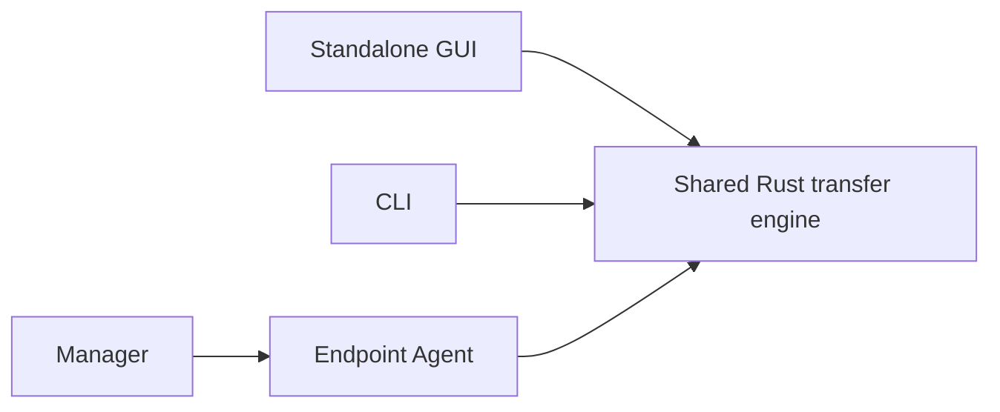

<p align="center">
  
</p>

# NetworkCopy Speed Edition

**Fast, restartable Windows folder transfers written in Rust.**

NetworkCopy Speed Edition transfers folders between Windows machines over a normal LAN, an explicit IP connection, or a direct Ethernet cable.

It is designed around a simple goal:

> Move data as fast as the machines and network reasonably allow, without giving up integrity, restartability, or ease of use.

The same Rust transfer engine powers the standalone GUI, command-line interface, endpoint Agent, and Manager-controlled transfers.

[Download releases](https://github.com/Nemeth-Tamas/networkcopy-speed/releases)

## What NetworkCopy can do

NetworkCopy supports:

* ordinary LAN transfers;
* direct computer-to-computer Ethernet transfers without a router, switch, DHCP server, or Internet connection;
* explicit IPv4 and IPv6 endpoints;
* automatic path calibration and multistream transfers;
* adaptive raw or Zstandard payload encoding;
* tiny-file packing;
* striped large-file transfers;
* interruption recovery and stripe resume;
* verified update transfers that skip unchanged files;
* exact receiver-side content reuse;
* content-defined deduplication for related files;
* fresh-transfer cross-file CDC using files committed earlier in the same session;
* Windows Desktop icon-layout migration;
* persistent Manager-side transfer queues;
* remote dual-pane browsing through endpoint Agents;
* automatic update preparation with size and SHA-256 verification;
* optional Authenticode signing for release builds.

NetworkCopy is currently **Windows-only**.

## Which executable should I use?

Release builds contain five executable variants.

| Executable                                         | Purpose                                                       |
| -------------------------------------------------- | ------------------------------------------------------------- |
| `NetworkCopy-Speed-vX.Y.Z-Manager-Windows-x64.exe` | Queue, browse and orchestrate transfers between remote Agents |
| `NetworkCopy-Speed-vX.Y.Z-Agent-Windows-x64.exe`   | Endpoint Agent for Manager-controlled transfers               |
| `NetworkCopy-Speed-vX.Y.Z-GUI-HU-Windows-x64.exe`  | Standalone GUI, Hungarian selected initially                  |
| `NetworkCopy-Speed-vX.Y.Z-GUI-EN-Windows-x64.exe`  | Standalone GUI, English selected initially                    |
| `NetworkCopy-Speed-vX.Y.Z-CLI-Windows-x64.exe`     | CLI, diagnostics and benchmark tools                          |

Both GUI builds contain both Hungarian and English. The executable variant only controls the initial language.

For two machines and an occasional transfer, use the standalone GUI.

For unattended transfers, multiple queued folders, or remote browsing, run the Agent on each endpoint and use the Manager.

## Transfer modes

### Automatic LAN

NetworkCopy discovers available endpoint Agents and selects addresses using Windows interface information, local-subnet affinity, and cross-Agent shared-LAN affinity.

This is intended to avoid choosing an APIPA address, virtual adapter, VPN interface, or other technically reachable but undesirable route when a normal LAN address is available.

### Direct Link

Two Windows computers can be connected directly with an Ethernet cable.

No router, switch, DHCP server, Internet connection, or manually assigned static address is required.

Direct Link prefers scoped IPv6 link-local communication and can fall back to IPv4 APIPA when necessary. Interfaces carrying a normal default route are rejected from the dedicated Direct Link path.

Discovery, calibration and transfer traffic are bound to the selected interface.

### Explicit IP

A receiver may also be selected directly by IPv4 or IPv6 address when automatic discovery is not appropriate.

This is useful for unusual network layouts, controlled testing, or manually selected routes.

## Manager and Agent

The Manager is an orchestration layer. It does **not** relay file payloads.

```text
          commands / status
        ┌───────────────────┐
        │                   │
     Manager           Sender Agent
                           │
                           │ file payload
                           ▼
                      Receiver Agent
```

Once a transfer is accepted, the sender communicates directly with the receiver.

Closing the Manager does not terminate an already-running transfer.

The Manager supports a persistent sequential queue, remote source and destination browsing, Automatic LAN, Direct Link and Explicit IP routes, retry and resume, cancellation, persistent history, restart reattachment, and automatic start-next behavior.

Endpoint Agents remain deliberately simple one-job-at-a-time executors. The Manager owns queue ordering and orchestration.

## v2.6 — measured performance work

v2.6 is primarily a transfer-engine optimization release.

The work was measurement-driven rather than based on simply adding more threads.

Major changes include path-aware transfer behavior, storage-media awareness, completion-time-aware compression decisions, reduced fresh-transfer CDC planning overhead, bounded CDC catalog state, elimination of duplicate execution-plan storage, session CDC basis-index caching, single-flight basis-index construction, and SSD/NVMe-only background CDC prebuilding.

Seek-penalty source storage is treated conservatively. Automatic calibrated transfers can serialize source access rather than multiplying random reads, and background CDC basis-index prebuilding is disabled when Windows reports a seek penalty or when the storage class cannot be determined.

The transfer wire protocol is currently:

```text
15
```

Older peers reach an explicit protocol-version check rather than silently interpreting incompatible data.

## v2.6 performance receipts

These measurements are included to document the optimization work, not to promise identical performance on every machine.

### Fresh CDC planning — 100,000-file synthetic workload

The synthetic scale probe contains:

```text
Source files:                100000
TCP lanes:                   4
Catalog generations:         196
Original transfer tasks:     100000
Moved execution tasks:       100000
Catalog candidate slots:     100000
Peak rolling basis IDs:      62500
Derived published file IDs:  100000
Retained published-ID slots: 0
Uncataloged file-ID slots:   0
Evicted file-ID slots:       37500
Duplicate source payload:    0 bytes
```

The final release-mode probe measured:

```text
Planner elapsed:             0.003412 s
Execution build elapsed:     0.003591 s
Combined:                    0.007003 s
```

During the v2.6 optimization work, the same planner workload in the original development configuration took approximately **25.28 seconds**.

After the structural planner changes, the comparable development-mode catalog plus execution-plan work had fallen to roughly **0.054 seconds**, an improvement of approximately **470×** before release-mode optimization is considered.

The final design also removed the old retained basis snapshots and duplicate execution-task storage.

For this 100,000-file workload, retained CDC-planner structures include:

```text
Rolling basis payload:       500000 bytes
Retained catalog ID payload: 300000 bytes
Catalog candidate payload:   1600000 bytes
Execution task payload:      3200000 bytes
Duplicate source payload:    0 bytes
```

This is a planner microbenchmark. It does **not** represent complete folder-transfer time.

### Session CDC basis-index optimization

A controlled 640 MiB workload used 80 related 8 MiB files. Sixteen files in the later generation could reuse one previously committed basis file.

Before basis-index caching:

```text
Basis index builds:          16
Distinct basis files:        1
Repeated index builds:       15
Indexed data:                128 MiB
Aggregate indexing time:     0.139649 s
```

After the bounded cache:

```text
Basis index builds:          4
Repeated index builds:       3
Cache hits:                  12
Indexed data:                32 MiB
```

After single-flight construction:

```text
Basis index builds:          1
Repeated index builds:       0
Cache hits:                  15
Indexed data:                8 MiB
```

The final SSD/NVMe background-prebuild path produced:

```text
Basis index builds:          1
Distinct basis files:        1
Repeated index builds:       0
Basis-index cache hits:      16
Background prebuilds:        1
Post-generation wait:        0.000012 s
```

The unavoidable index was therefore built once while useful transfer work was already happening, leaving approximately **12 microseconds** of measured generation-transition wait in this run.

Background prebuilding is deliberately disabled for seek-penalty and unknown storage.

### Raw 512 MiB loopback transfer

A separate local benchmark used 32 deterministic incompressible 16 MiB files.

It intentionally produced no CDC reuse and no compressed records.

```text
Files copied:                32
Logical data:                536870912 bytes
Application wire:            536872557 bytes
CDC offers:                  0
Compressed records:          0
BLAKE3 integrity:            verified

Data transfer time:          0.309433 s
Total time:                  0.310753 s
Payload throughput:          1735.02 MB/s
                              1654.64 MiB/s
```

Aggregate worker-stage measurements were:

```text
Source reads:                0.095467 s
Compression/probe:           0.092823 s
Socket writes:               0.317246 s
Receiver socket reads:       0.292531 s
Destination writes:          0.156158 s
```

This is a **local Windows loopback benchmark**, not a physical-network throughput claim. Real transfer speed depends on storage, CPU, network adapters, drivers, Wi-Fi conditions, Ethernet link speed, cabling and workload.

### Physical two-machine acceptance

The transfer engine has also passed physical two-machine LAN acceptance.

One representative run achieved:

```text
Payload throughput:          98.48 MB/s
Related logical file:        60 MiB
Receiver-side reused data:   59.88 MiB
CDC index transmitted:       0 bytes
CDC savings:                 99.80%
```

Independent SHA-256 verification matched every transferred file.

Synthetic loopback results and physical-network results are intentionally reported separately.

## How the transfer engine works

A transfer starts by scanning the source tree and building a deterministic manifest.

The sender and receiver establish one control connection plus one or more data lanes. Network calibration and path policy determine how much concurrency is useful rather than assuming that more TCP streams are always faster.

Different file classes then take different paths:

```text
tiny files
    → bounded packs
    → adaptive raw / Zstandard encoding

medium files
    → whole-file transfer
    → verified exact reuse
    → CDC reconstruction when useful

large files
    → multi-lane stripes
    → resumable stripe checkpoints
    → reuse paths where appropriate
```

All paths converge on integrity verification and final destination publication.

The GUI, CLI, Agent and Manager all use this same transfer library.

## Adaptive compression

Compression is not forced on every payload.

NetworkCopy probes transferable records and compares compression work against the expected transfer benefit.

Compressible data can use Zstandard.

Incompressible data falls back to raw transfer instead of wasting CPU to produce a payload that is effectively the same size.

This decision is made per transferable record, so one folder may contain both compressed and raw data.

## Content-defined reuse

NetworkCopy uses content-defined chunking for related-file reuse.

Chunk boundaries use a Gear-style rolling hash, while chunk identity and final integrity use BLAKE3.

A simple insertion therefore does not invalidate every block after the insertion point.

```text
Receiver already has:

[ A ][ B ][ C ][ D ][ E ]

Sender wants:

[ A ][ B ][ NEW ][ C ][ D ][ E ]

A reconstruction plan can describe:

COPY A + B
WRITE NEW
COPY C + D + E
```

Neighboring references are merged into larger ranges rather than sending one network command per chunk.

If CDC would not save enough wire data, exceeds its bounded planning limits, or cannot find a useful basis, NetworkCopy automatically falls back to the ordinary transfer path.

## Fresh-transfer CDC

Fresh destinations normally have no older file to use as a basis.

NetworkCopy solves this with deterministic transfer generations.

Files from a completed generation are verified and committed before they become eligible as bases for later generations.

```text
Generation 0
    ↓ transfer
    ↓ verify
    ↓ commit
    ↓ publish as trusted basis

Generation 1
    ↓ may reuse Generation 0 content
```

A later lane can therefore never reference a file that another lane has not finished and committed.

The rolling catalog is bounded, deterministic and reconstructable after interruption.

v2.6 additionally keeps basis indexes in a bounded session cache, suppresses concurrent duplicate construction of the same index, and can prebuild the most likely next basis in the background on no-seek-penalty storage.

## Exact reuse

Content-defined reconstruction is not used when an exact existing copy is already available.

Exact matches are reused directly after verification.

This applies to fresh-transfer reuse as well as update workflows and avoids transmitting data that the receiver already has.

## Integrity and destination safety

BLAKE3 verification is part of the transfer engine rather than an optional post-transfer mode.

NetworkCopy verifies reconstructed and transferred content before treating it as complete.

Update and CDC paths preserve the old destination until replacement data has been successfully reconstructed and verified.

Interrupted CDC plan transmission does not partially overwrite the existing destination.

Metadata restoration occurs after successful file completion.

## Cancellation, interruption and resume

Transfers are designed to survive interruption without assuming that partially written data is valid.

Large-file stripes can be recorded in the destination-side resume journal.

Fresh-transfer generation commits are persisted so a restarted session can rebuild the same deterministic rolling CDC state.

Committed files are revalidated before they are trusted.

If a file that should be reusable has changed or become corrupted, NetworkCopy rejects the stale state rather than silently skipping it.

A successful completed transfer removes the corresponding resume state.

The release gate includes ignored recovery-torture matrices covering repeated interruption and restart scenarios.

## Windows Desktop layout migration

When the transferred source is a Windows Desktop, NetworkCopy can preserve ordinary Desktop item layout metadata.

The captured snapshot can include item positions, icon size, Auto Arrange state, monitor geometry, work areas and DPI information.

The receiver maps transferable items onto the destination Desktop and clamps restored positions to visible work areas.

Missing, renamed, virtual, Public Desktop or otherwise non-transferable Shell items do not turn an otherwise successful file transfer into a failed transfer.

Desktop layout transfer is optional and bounded.

## Persistent transfer queue

The Manager owns a persistent sequential queue.

Multiple source/destination pairs can be prepared and left running unattended.

Queue state includes ordering, route intent, recovery information and active endpoint binding information.

The Manager supports retry, skip, cancellation, run-again behavior, pause-after-current, restart reattachment and journal-backed resume.

Sequential reliability is intentional: one sender/receiver pair runs at a time.

## Batch transfer setup

Several source folders can be collected and mapped beneath one receiver destination root before being added to the queue.

The Manager previews the resulting destination paths and checks collisions before adding the batch atomically.

This is useful for common migration jobs such as:

```text
Desktop
Documents
Downloads
Pictures
...
```

without manually waiting for each folder to finish before starting the next one.

## Updates

The Manager can check GitHub Releases for newer stable versions.

It does not silently replace itself.

When the user explicitly prepares an update, NetworkCopy selects the correct application asset, verifies the reported size and SHA-256 digest, stages the candidate beneath LocalAppData, and uses a process-bound handoff for publication and startup verification.

The update path includes rollback behavior when the replacement cannot be verified or started successfully.

## Release trust and antivirus

Release packaging supports optional Windows Authenticode signing from the certificate store with RFC 3161 SHA-256 timestamping.

Unsigned local development builds are also supported.

For details about signing, executable trust and antivirus behavior, see:

[Release Trust and Antivirus Guidance](RELEASE-TRUST.md)

## Security model

NetworkCopy is optimized for **trusted local networks**.

The current management protocol is not intended as an Internet-facing remote-administration service.

Manager/Agent control traffic is currently unauthenticated and unencrypted.

Do not expose the management Agent directly to an untrusted network or the public Internet.

Payload integrity verification protects against accidental corruption; it is not a substitute for authenticated encrypted transport against a hostile peer.

Authentication, encrypted management traffic and stronger remote-filesystem authorization remain separate future security work.

## Quick start — standalone GUI

Start the GUI on both machines:

```powershell
networkcopy-gui.exe
```

For a normal LAN transfer, select the appropriate receive/send mode and use the receiver's address.

For Direct Link:

1. connect the two machines with an Ethernet cable;
2. start **Receive** on the destination machine;
3. choose **Direct cable**;
4. select the destination folder;
5. approve elevation if Windows Firewall configuration requires it;
6. start **Send** on the source machine;
7. choose **Direct cable** and the source folder.

Direct Link discovery and path calibration are automatic.

## Quick start — Manager

Run the Agent on both transfer endpoints:

```powershell
networkcopy-agent.exe
```

The Agent requests elevation when required and exposes a notification-area icon showing whether the endpoint is idle or busy.

Then run the Manager:

```powershell
networkcopy-manager.exe
```

The Manager can discover both Agents, browse their filesystems, assign sender and receiver roles, create queued transfers and monitor progress.

The Manager itself does not need to stay open after both endpoints have accepted a transfer.

## Command-line examples

Show all available commands:

```powershell
networkcopy-speed.exe --help
```

Show the version:

```powershell
networkcopy-speed.exe version
```

Direct Link receiver:

```powershell
networkcopy-speed.exe direct-receive "C:\Destination"
```

Direct Link sender:

```powershell
networkcopy-speed.exe direct-send "C:\Source" 4 64
```

Inspect storage classification:

```powershell
networkcopy-speed.exe probe-storage-media "C:\Source"
```

Run a local multistream transfer benchmark:

```powershell
networkcopy-speed.exe bench-multistream-copy `
    "C:\Source" `
    "C:\Destination" `
    4 `
    4
```

The CLI also exposes internal network, storage, compression, CDC, reconstruction, IOCP and diagnostic benchmarks used during development.

## Building from source

Requirements:

```text
Windows 10 or Windows 11
stable Rust toolchain
MSVC Rust target
Visual Studio C++ build tools
```

Build the CLI:

```powershell
cargo build `
    --release `
    --bin networkcopy-speed
```

Build the Agent:

```powershell
cargo build `
    --release `
    --bin networkcopy-agent
```

Build the Manager:

```powershell
cargo build `
    --release `
    --bin networkcopy-manager
```

Build the GUI with Hungarian selected initially:

```powershell
cargo build `
    --release `
    --bin networkcopy-gui `
    --no-default-features
```

Build the GUI with English selected initially:

```powershell
cargo build `
    --release `
    --bin networkcopy-gui `
    --no-default-features `
    --features default-language-en
```

## Development quality gate

Normal development changes are expected to pass:

```powershell
cargo fmt

cargo test

cargo clippy `
    --all-targets `
    --all-features `
    -- `
    -D warnings
```

The long-running recovery torture tests are intentionally ignored by ordinary `cargo test`.

They can be run separately with:

```powershell
.\scripts\run-v21-torture.ps1 -Rounds 10
```

## Release build

The release builder performs formatting checks, locked tests, strict Clippy, optional recovery torture, optimized executable builds, CLI version smoke testing, optional Authenticode signing and release checksum generation.

For a development-version release candidate:

```powershell
.\scripts\Build-Release.ps1 `
    -AllowDevelopmentVersion `
    -TortureRounds 10
```

For a final stable release after `Cargo.toml` has been changed to the stable version:

```powershell
.\scripts\Build-Release.ps1 `
    -TortureRounds 10
```

Do not use `-SkipChecks` for a release.

## Architecture

The repository intentionally keeps every front end on one shared transfer implementation.



Core responsibilities include manifest scanning, transfer planning, network calibration, path handling, adaptive compression, tiny-file packing, large-file striping, resume state, exact reuse, CDC reconstruction, BLAKE3 verification, metadata restoration and transfer telemetry.

The Manager is orchestration; the Agent invokes the same transfer engine used by the standalone programs.

## Design priorities

NetworkCopy deliberately prioritizes:

```text
1. transfer speed
2. ease of use
3. reliability and integrity
4. low operational friction
```

Performance changes are expected to be measured.

More concurrency is not automatically treated as an optimization.

A change that looks clever but loses a benchmark is allowed to die. :)

## Project scope

NetworkCopy is built for local Windows machine-to-machine transfers.

The project is not trying to become a cloud storage service, Internet file-sharing platform or general remote-administration suite.

The focus remains fast local transfer, straightforward setup, deterministic integrity, interruption recovery and practical migration workflows.

## Next

After v2.6, development moves to the v2.7 UI/UX redesign.

The transfer engine is intentionally being left alone long enough for the interface to catch up with what it can now do. :)

## License

See [LICENSE](LICENSE) for licensing terms.
